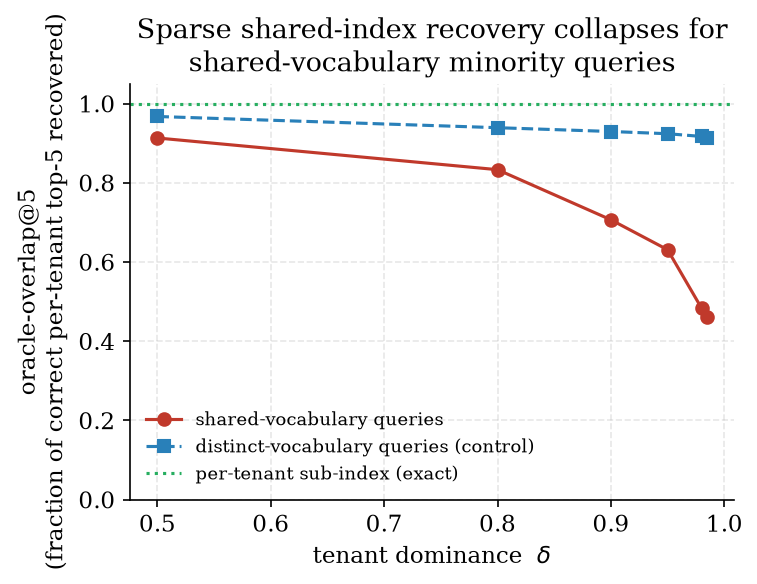
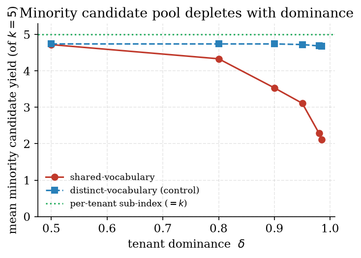
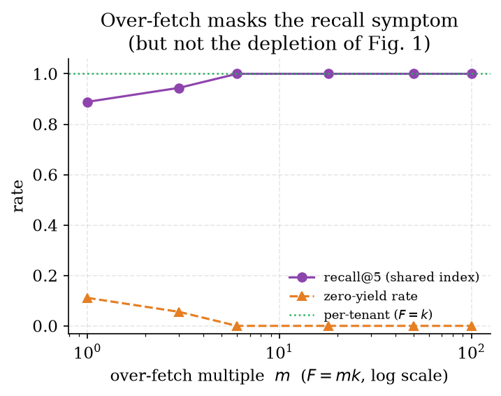
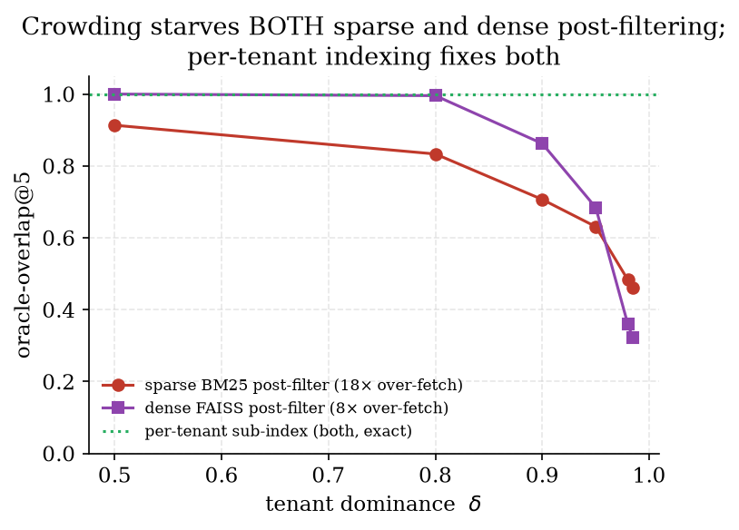

# Sparse-Retrieval Tenant Starvation: A Lexical Post-Filtering Failure Mode in Shared-Index Multi-Tenant Retrieval, and a Per-Tenant Sub-Index Remedy

**Ayman Kazim Yousef**
Undergraduate Student, Department of Artificial Intelligence Engineering, AlSafwa University, Karbala, Iraq
ORCID: 0009-0006-7409-9367 · ai25009@student.alsafwa.edu.iq

**Keywords:** multi-tenant retrieval; BM25; sparse retrieval; metadata filtering; retrieval-augmented generation; collection statistics

---

## Abstract

A multi-tenant retrieval-augmented generation (RAG) system serves many users from one deployment, and a near-universal engineering pattern stores every tenant's passages in a single shared lexical (BM25) index, retrieves a global top-N by score, and then *post-filters* the results to the querying tenant. We identify, name, and quantify a failure mode of this pattern that we call **sparse-retrieval tenant starvation**: when one tenant dominates the corpus, the global top-N is occupied by the dominant tenant's passages, so a minority tenant's relevant passages are cut off *before* the post-filter and never reach reranking — the minority tenant is starved of its own candidates. We show, on a real on-device library with a measured **98.5 % / 1.5 %** tenant skew, that the effect is governed not by tenant size alone but by **query–dominant-tenant vocabulary overlap**: for minority queries whose terms are shared with the dominant tenant's corpus, the shared index recovers only **46 %** of the candidate set that a tenant-local index would return at the real skew (and the candidate yield falls from 4.7 to 2.1 of 5), whereas for queries on vocabulary distinct from the dominant tenant the effect is absent (overlap stays 0.91–0.97 across all skews) — a clean negative control confirming the mechanism. We further show — correcting a tempting oversimplification — that **both sparse and dense post-filtering starve under dominance**: a *measured* dense (FAISS) post-filter on the same corpus collapses from oracle-overlap 1.0 to **0.32** at the real skew (in fact below the sparse path's 0.46), because *crowding* — committing the global top-N before the tenant filter — afflicts both. The genuine asymmetry is twofold and we quantify it: a sparse index *additionally* suffers **shared-collection-statistics distortion** (inverse document frequency set by the dominant tenant — an ablation attributes 0.14 of the sparse loss to it and 0.39 to crowding), which corpus-composition-independent dense similarity does not; and dense approximate-nearest-neighbour (ANN) search has a *structural* cure for crowding — in-traversal predicate filtering (as in Filtered-DiskANN and ACORN) — that a shared inverted index lacks short of a per-tenant sub-index. The per-tenant sub-index restores exact, dominance-independent recovery (overlap 1.0) on both sides and is the *only* structural remedy on the sparse side. The widely-used mitigation — over-fetching far more than N before filtering — only papers over the recall of the single best match (we measure 11 % zero-yield at no over-fetch, removed by over-fetching ≥ 6×) while leaving the candidate-pool depletion intact and imposing a cost that grows with corpus size. We adopt a per-tenant sparse sub-index — built lazily on first query, cached in RAM, and auto-invalidated by a corpus-state signature — that makes minority-tenant retrieval exact (recall and oracle-overlap 1.0) and dominance-independent at a one-time ~2.7 ms build cost per tenant. We are explicit about scope: this is a reproducible micro-benchmark on one machine over a small, naturally-skewed corpus with passage-derived probe queries, not a large labelled IR evaluation, and we do not claim the per-tenant-index *construction* is itself novel (production vector databases shard per tenant). Our contribution is the **diagnosis**: the identification, vocabulary-conditioned characterization, and sparse-versus-dense analysis of a retrieval-correctness failure we could find documented only in practitioner forums, never in a peer-reviewed venue. The system and the deterministic experiment scripts are released for reproduction.

---

## 1. Introduction

A multi-tenant retrieval-augmented generation (RAG) system [10] serves many independent users — *tenants* — from a single deployment, where each tenant owns a private collection of documents and every query must be answered only from that tenant's own collection. The dominant engineering pattern for the lexical half of such a system is simple and, on its face, obviously correct: keep all tenants' passages in one shared BM25 index [16], retrieve the global top-N passages by relevance score for a query, and then **post-filter** the retrieved list down to the rows whose tenant identifier matches the querying tenant. The shared index is attractive because it is cheap — one index, one set of postings, one cache — and because the post-filter is a trivial metadata predicate.

This paper is about a way in which that pattern is silently, and sometimes severely, wrong.

### 1.1 The starvation mechanism

Consider a deployment in which one tenant owns the overwhelming majority of the corpus. This is not a contrived case: it is the *typical* steady state of a shared system whose users adopt it at different times and upload at different rates. In the live on-device library we study, a single tenant owns **3,725 of 3,783** tenant-attributed passages — **98.5 %** — while the next tenant owns **58** (1.5 %). When a minority tenant issues a query, BM25 scores every passage in the *shared* corpus and returns the global top-N. Because the dominant tenant contributed almost all of the corpus, it also contributed almost all of the passages that contain any given query term; those passages fill the global top-N. The minority tenant's relevant passages — even when they are genuinely on-topic — are ranked below the cut and are discarded *before* the post-filter ever runs. The post-filter then selects from a list that already contains few or none of the minority tenant's passages, and the minority tenant is **starved** of its own candidates: the reranker and the language model downstream never see the evidence that would have answered the query.

Two compounding facts make this worse than a naive analysis suggests. First, BM25 is not scored in a vacuum: its inverse-document-frequency (IDF) term is computed over the *whole* shared collection [15, 16], so the dominant tenant does not merely contribute more candidates — it *sets the collection statistics* that determine how every term is weighted, distorting the ranking against a minority tenant whose term distribution differs. Second, the standard defence — over-fetching many more than N passages before post-filtering — trades a growing compute cost for a partial fix: it can recover the single best-matching passage, but, as we show, it does not restore the minority tenant's full candidate pool, and the over-fetch depth required grows with the size of the dominant corpus.

### 1.2 What we claim, and what we do not

We describe **maktaba-web-local** (المكتبة الناطقة, "The Speaking Library"), a fully-offline, on-device, multi-tenant Arabic+English digital-library RAG system, and within it the diagnosis and remedy of sparse-retrieval tenant starvation.

We claim four things. First, that sparse-retrieval tenant starvation is a real, reproducible retrieval-correctness failure mode of the shared-index-plus-post-filter pattern under tenant dominance. Second, that its severity is governed by **query–dominant-tenant vocabulary overlap**, not by tenant size in isolation — a distinction we establish with a negative control. Third, that **crowding starves both sparse and dense post-filtering** — we measure a dense path collapsing to 0.32 overlap at the real skew — so the per-tenant index is needed on both sides; the two genuine asymmetries are that the shared-statistics (IDF) distortion is *sparse-only* (ablated at 0.14 of the loss), and that the structural in-traversal cure for crowding is available to dense ANN but not to a shared inverted index short of a per-tenant index. Fourth, that a per-tenant sparse sub-index removes the failure exactly and at negligible cost, and is therefore the correct remedy rather than ever-larger over-fetching.

We are equally explicit about what we do **not** claim. We do **not** claim that the per-tenant sub-index *construction* is novel: production vector databases already shard or namespace per tenant (e.g., Pinecone namespaces, Weaviate per-tenant indexes, Qdrant tenant-filtered traversal), and Curator [8] explicitly names the per-tenant-versus-shared trade-off — though, crucially, as a *memory-and-performance* trade-off for *dense* indexes, not as a *correctness* problem for *sparse* ones. We do **not** claim a large-scale result: our evaluation is a deterministic micro-benchmark on one CPU machine over a small (13-book, two-tenant) naturally-skewed corpus, with passage-derived probe queries rather than a labelled query log, so it characterizes the *mechanism* rather than measuring deployment-wide answer quality. And we do **not** claim that over-fetching never helps — it demonstrably restores top-1 recall — only that it is the wrong primitive, because it masks rather than removes the candidate depletion and scales its cost with the dominant corpus. The genuinely novel element is the **diagnosis**: to our knowledge the sparse post-filter starvation mechanism, its vocabulary-overlap trigger, and the sparse-versus-dense asymmetry have been discussed only in practitioner folklore (issue trackers and engineering blogs) and never characterized in a peer-reviewed venue. We state the threats to that diagnosis in full in Section 7.

### 1.3 Contributions

- **The starvation mechanism, named and analysed.** We identify a retrieval-correctness failure of shared-index multi-tenant *sparse* retrieval: under tenant dominance, the global top-N is committed before the tenant post-filter, so a minority tenant's relevant passages are discarded pre-filter, and the dominant tenant additionally sets the shared collection statistics (IDF) that weight the ranking (§3).
- **A vocabulary-conditioned characterization with a negative control.** On a real 98.5 %/1.5 % skew, we show the effect is driven by query–dominant-tenant vocabulary overlap: minority queries on shared vocabulary lose more than half their candidate pool at the real skew (oracle-overlap 0.46, yield 2.1 of 5), while minority queries on distinct vocabulary are unaffected at every skew (overlap 0.91–0.97) — isolating the cause from tenant size (§6.2).
- **A measured sparse-versus-dense analysis.** We *measure* that dense FAISS post-filtering starves too (overlap 1.0→0.32 at the real skew), refuting the intuition that dense retrieval is immune, and we ablate the sparse loss into **crowding (0.39)** and **shared-statistics distortion (0.14)**. The two genuine asymmetries are that the statistics distortion is *sparse-only*, and that the structural in-traversal cure for crowding (Filtered-DiskANN, ACORN) has no shared-inverted-index analogue other than a per-tenant index (§3.3, §6.5, §6.6).
- **An over-fetching cost analysis.** We quantify that over-fetching restores top-1 recall (11 % zero-yield at no over-fetch, eliminated by ≥ 6× over-fetch) but not candidate yield, and that the required depth grows with the dominant corpus — establishing why over-fetching is a mask, not a fix (§6.3).
- **A lazily-built, cache-invalidated per-tenant sub-index remedy.** We adopt a per-tenant sparse sub-index, built on first query, cached in RAM, auto-invalidated by an `(identity, length)` corpus-state signature, memory-bounded, with transparent fallback; it yields exact, dominance-independent minority retrieval (recall and overlap 1.0) at a one-time ~2.7 ms build per tenant (§5, §6.4).
- **A reduced-to-practice, released artifact.** The complete offline system and the deterministic experiment scripts (`exp_p1_starvation.py`) are released so every number regenerates end-to-end.

### 1.4 Reproducibility

Every number in this paper is produced by deterministic scripts — `exp_p1_starvation.py` (the dominance, over-fetch, and rank-distribution results), `exp_p1b_ablation.py` (the crowding-vs-statistics-capture decomposition and bootstrap confidence intervals), and `exp_p1c_dense.py` (the measured dense baseline) — run by the author on the real corpus — 3,838 indexed passages across 13 books and two tenants — on CPU, using the system's own Arabic normaliser, stop-word list, and the bm25s lexical engine [11]. The only randomness is the sub-sampling that creates controlled tenant-dominance levels; it is seeded and averaged over five fixed seeds (0–4), and all probe queries are deterministic passage-derived spans (no RNG in query construction). The remedy's cache key, bounds, and fallback are exactly those of the deployed `HybridRetriever`. A reader pointing the script at the same corpus obtains the same overlap, yield, and recall curves.

## 2. Related Work

Our contribution sits at the intersection of four threads: multi-tenant vector indexing, filtered approximate-nearest-neighbour (ANN) search, the collection-statistics foundations of lexical retrieval, and retrieval fairness. We position our work against each in turn, stating precisely where prior art stops and our diagnosis begins.

### 2.1 Multi-tenant vector databases

A line of systems work makes retrieval *multi-tenant*: a single deployment serves many users while restricting each query to that user's own vectors. Curator [8] provides efficient per-tenant indexing for shared vector databases and explicitly frames the choice between a shared index and per-tenant indexes — but it frames it as a **memory-and-search-performance** trade-off for *dense* indexes, optimizing the cost of isolation, not as a question of retrieval *correctness*. Production vector databases ship per-tenant sharding (namespaces, per-tenant graphs, tenant-keyed payload filtering) as standard engineering practice. None of this work observes that for the *sparse* (lexical) half of a hybrid retriever, a shared index is not merely *more expensive* than per-tenant indexes but, under dominance, *incorrect* — it drops relevant minority candidates before the tenant filter is applied. We take per-tenant isolation as the remedy precisely because it restores correctness, and we contribute the analysis of *why* the sparse shared index fails where the dense one does not.

### 2.2 Filtered approximate-nearest-neighbour search

The dense-retrieval community has studied the interaction of attribute filters with ANN search in depth. Filtered-DiskANN [5] augments graph-based ANN so traversal stays within vectors matching a label predicate; ACORN [14] supports predicate-agnostic, high-cardinality filtering while preserving ANN performance; Window Filters [4] and recent filtered-ANN benchmarks [7] characterize how post-filtering can return far fewer than k results under restrictive filters. The decisive point for us is that these methods *solve* the dense version of the problem by evaluating the predicate **during** traversal — the search keeps walking the graph until it has accumulated k matching results — so the candidate set is never starved by a selective filter. This is exactly the mechanism that *can prevent* tenant starvation on the dense side, and a shared inverted index has no analogue: a sparse index produces a single globally-ranked list whose top-N is committed before the tenant predicate is applied. (A dense index that merely over-fetches then post-filters — as many deployments, including ours, do — does not get this guarantee for free; it inherits it only when the filter is pushed into traversal.) Our work transfers the "post-filter recall collapse" phenomenon, hitherto characterized only for dense embeddings, to *lexical* retrieval — where, as we show, it is compounded by an effect with no dense counterpart: shared collection statistics.

### 2.3 Collection statistics in lexical retrieval

BM25 [15, 16] weights each query term by an inverse-document-frequency factor computed over the entire indexed collection. This collection dependence is normally invisible; it becomes load-bearing here. In a shared multi-tenant index the dominant tenant determines the document frequencies, and therefore the term weights, for *all* tenants — a minority tenant is ranked under statistics it did not generate. The mirror image of this problem is well known in distributed IR: when an index is *sharded*, per-shard statistics diverge and systems recombine them globally (e.g., distributed-IDF mechanisms in Elasticsearch and Solr) to recover a consistent ranking. Our setting inverts that remedy: the statistics are already global, and *that* is the bug — the fix is to **localize** them per tenant. Sparse and dense representations are known to behave differently as retrieval signals [12]; our asymmetry is a concrete, operational instance of that difference in the multi-tenant regime.

### 2.4 Retrieval fairness

A separate literature studies fairness in ranking. Fairness-of-exposure [18] and equity-of-attention [1] *deliberately* trade relevance for a fairer distribution of exposure across items or groups. More recently, fairness has been studied in multi-tenant RAG at the *caching* layer [17], and RAG fairness work shows that injecting weakly-relevant context degrades output fairness, especially for the small models we target [3, 6, 19]. Tenant starvation is a different kind of unfairness: it is not a policy choice to reallocate exposure, but an *unintended mechanism artifact* in which a tenant's relevant documents are dropped before ranking is even evaluated — an upstream retrieval-*availability* failure that no fair generator or fair cache can repair, because the evidence never enters the candidate set. We measure retrieval recovery, not a fairness metric, and we do not claim a fairness result; we note the connection because the failure's incidence falls on minority tenants.

### 2.5 Distinction

The whitespace our work occupies is a conjunction rather than any single property. Prior multi-tenant indexing optimizes the *cost* of isolation (dense); prior filtered-ANN work *prevents* post-filter starvation (dense, in-traversal); prior distributed-IR work *globalizes* fragmented statistics (the inverse of our remedy); prior fairness work reallocates *exposure* (deliberately). None identifies the sparse post-filter starvation mechanism, conditions it on query–dominant-tenant vocabulary overlap, or states the sparse-versus-dense asymmetry as such. That diagnosis — not the per-tenant sub-index, which is standard engineering — is our contribution.

## 3. Problem Formulation

### 3.1 Multi-tenant retrieval with post-filtering

A deployment serves tenants `T = {t_1, …, t_m}`. Tenant `t` owns a private passage collection `C_t`; the shared corpus is `C = ⋃_t C_t`, with `|C| = N`. A *dominance* `δ_t = |C_t| / |C|` measures how much of the corpus a tenant owns. For a query `q` from tenant `t`, the system must return the top-`k` passages of `C_t` — and *only* of `C_t` — under a relevance scorer.

The shared-index lexical retriever realizes this in two stages:

1. **Score-then-truncate.** Compute `BM25(q, c)` for every `c ∈ C` against the single shared index, and take the global top-`F` passages `R_F(q) ⊆ C`, where `F ≥ k` is the *fetch depth* (an over-fetch multiple of `k`).
2. **Post-filter.** Return the first `k` passages of `R_F(q)` whose tenant equals `t`: `topk( {c ∈ R_F(q) : tenant(c) = t} )`.

The defect is structural and lives between the two stages: step 1 commits to `R_F(q)` using a ranking over all of `C`, and step 2 can only select from whatever survived. If fewer than `k` of `t`'s passages appear in `R_F(q)`, the tenant cannot receive `k` results no matter how relevant its collection is.

### 3.2 The starvation condition

Let `n_t(q, F) = |{c ∈ R_F(q) : tenant(c) = t}|` be the **yield**: how many of tenant `t`'s passages survive into the global top-`F`. Starvation is the regime `n_t(q, F) < k` (and, acutely, `n_t(q, F) = 0`, a *zero-yield* query). Whether starvation occurs depends on how many of the dominant tenant's passages outscore tenant `t`'s relevant passages for `q`. Two forces drive this:

- **Candidate crowding.** The dominant tenant contributes `δ ≈ 0.985` of all passages, hence ≈ `δ` of all passages containing any common query term; these crowd the global top-`F`.
- **Statistics capture.** BM25's IDF for each term is set by document frequencies over `C`, which the dominant tenant determines; the minority tenant's passages are scored under weights it did not generate.

Crucially, both forces act *only through shared query vocabulary*. If `q`'s terms are rare in the dominant collection (the minority tenant's topic is distinct), the dominant tenant contributes few competing matches and starvation does not occur. If `q`'s terms are common in the dominant collection (shared academic vocabulary), crowding and statistics capture both bite. Tenant size alone is therefore *not* the predictor; **query–dominant-tenant vocabulary overlap** is. Section 6.2 confirms this with a negative control.

**Proposition 1 (Starvation condition).** Fix a query `q`, fetch depth `F`, and `k ≤ F`. Tenant `t` is starved (`n_t(q,F) < k`) exactly when fewer than `k` of `t`'s passages appear among the global top-`F` under the shared-index scorer. Let `D(q)` be the number of *dominant*-tenant passages whose score exceeds `t`'s `k`-th best relevant passage for `q`. Then `n_t(q,F) ≥ k` requires `F ≥ k + D(q)`. Since `D(q)` counts dominant passages out-scoring a fixed minority passage, it is non-decreasing in the dominant tenant's size for any query whose terms have positive document frequency in the dominant collection; hence for every fixed `F` there is a dominance `δ` beyond which `D(q) > F − k` and the tenant is starved. Queries whose terms have zero dominant-collection frequency have `D(q) = 0` and never starve — the vocabulary-overlap dependence above. *(Stated as a structural condition, not a probabilistic bound; the empirical curves of Section 6 instantiate it.)*

### 3.3 The dense contrast

The dense half of the same hybrid retriever shares one of the two starvation forces and escapes the other. It **escapes statistics capture**: the cosine similarity between a query and a passage embedding does not depend on the rest of the corpus, so the dominant tenant cannot distort *how* the minority tenant's passages are scored — only *how many* precede them. But it does **not** escape **crowding**. The deployed dense path over-fetches `fetch_k = min(8k, N)` and then post-filters by tenant — the same search-then-filter ordering as the lexical path — so under dominance the global top-`fetch_k` fills with the dominant tenant's semantically-close passages and the minority's are cut off before the filter. We measure this directly (Section 6.6): dense oracle-overlap collapses from 1.0 to **0.32** at the real skew, in fact *below* the sparse path (whose larger over-fetch buys back more of the single best match). The intuition that dense retrieval is immune to tenant starvation is therefore **wrong**: both post-filtering paths starve; cosine's corpus-independence removes only the statistics-capture term, not crowding.

Where the two paths genuinely differ is the **structural cure available for crowding**. Dense ANN can push the tenant predicate *inside* the search: filtered-ANN methods evaluate it during traversal and keep walking until `k` matching neighbours are found [5, 14, 4], and production vector databases ship per-tenant or in-traversal filtering for exactly this reason — eliminating crowding without unbounded over-fetch. A shared inverted index has no such in-scoring filter; its only equivalent structural remedy is the per-tenant sub-index of Section 4. So the sparse path suffers an *extra* failure component (statistics capture) **and** has fewer structural cures — which is why the per-tenant index matters most, and first, there — though the per-tenant remedy is needed on the dense side too unless in-traversal filtering is adopted.

### 3.4 Why over-fetching is a mask, not a fix

The folklore remedy is to raise `F`. Increasing `F` does eventually pull a minority tenant's single best match back into `R_F(q)`, because that passage, being the strongest lexical match, sits high in the *minority-internal* order even if many dominant passages precede it globally. But two problems remain. First, the *yield* `n_t(q, F)` — the size of the minority tenant's candidate pool that reaches reranking — is depleted long before zero-yield is reached, so the reranker and language model are starved of context even when top-1 is recovered. Second, the `F` required to keep yield high grows with `|C_dominant|`: a fix that must scale its fetch depth (and thus its per-query cost) with the dominant tenant's uploads is not a fix but a deferral. We quantify both in Section 6.3.

## 4. Method: Per-Tenant Sparse Sub-Indexing

The remedy follows directly from the diagnosis: if the failure is that the global top-`F` is committed before the tenant filter, then the filter must be applied *before* scoring — i.e., the BM25 statistics and ranking must be computed over `C_t`, not `C`. Concretely, for a query from tenant `t`, retrieval runs against a **per-tenant sparse sub-index** built over `C_t` alone. Within that sub-index:

- document frequencies, and therefore IDF weights, are the tenant's own (statistics capture is eliminated);
- the global top-`k` is, by construction, the tenant's top-`k` (candidate crowding is eliminated);
- no over-fetch is needed: `F = k` suffices because every retrieved passage already belongs to `t`.

The engineering requirement is to obtain this without paying to maintain `m` indexes eagerly. The deployed design (Section 5) builds each tenant's sub-index **lazily**, on that tenant's first query, caches it in RAM, and invalidates it automatically when the corpus changes — so the cost is one small build per active tenant, amortized over all that tenant's subsequent queries, and zero for tenants who never query.

#### Algorithm 1 — Per-tenant sparse retrieval

```
Input : query q, tenant t, shared corpus C (list), top-k
State : cache U : tenant → (sig, index, sub_corpus)   # bounded, in-RAM
Output: up to k passages of C_t, tenant-locally ranked

1  sig ← (identity(C), length(C))                 # cheap corpus-state signature
2  if U[t] exists and U[t].sig = sig:
3      idx, sub ← U[t].index, U[t].sub_corpus      # cache hit
4  else:
5      sub ← [ c ∈ C : tenant(c) = t ]             # filter BEFORE scoring
6      if sub = ∅: return []                        # nothing to retrieve
7      idx ← BM25_index( normalize(c) for c ∈ sub ) # tenant-local statistics
8      if |U| > MAX_TENANTS: U.clear()              # memory bound
9      U[t] ← (sig, idx, sub)
10 return topk( idx.retrieve(normalize(q), k) )     # F = k; no over-fetch
```

Two design choices make the cache correct and cheap. The signature `sig = (identity(C), length(C))` invalidates automatically on any corpus mutation: ingestion either reassigns the corpus list (new identity) or extends it (new length), so a stale sub-index is detected on the next query without any explicit invalidation call at the mutation sites. And the cache is size-bounded (clearing when it exceeds a fixed tenant count) so that a deployment with very many tenants cannot exhaust memory; an evicted tenant simply rebuilds on its next query. If the sub-index cannot be built (an unsupported BM25 backend, or any build error) the retriever falls back to the shared-index-plus-post-filter path, so the remedy never reduces availability.

## 5. System and Implementation

`maktaba-web-local` is a fully-offline, on-device, multi-tenant Arabic+English digital-library RAG system: a FastAPI backend with a hybrid retriever (BM25 via bm25s [11] fused with dense FAISS-HNSW search [9, 13] by Reciprocal Rank Fusion [2], then cross-encoder reranking), a local large language model, and strict per-tenant isolation enforced at every stage. The components relevant to this paper are the two retrieval paths and the per-tenant sub-index.


**Hybrid retriever.** For a query the retriever over-fetches `fetch_n = 6k` candidates from each of the lexical and dense paths, fuses them by RRF, reranks, and returns the top-`k`. The lexical path is the locus of starvation; the dense path is its structural control.

**The two lexical paths.** The deployed `_bm25_search` takes the per-tenant path when a tenant id is supplied: it calls `_get_user_bm25(t)`, tokenizes the normalized query with the shared Arabic stop-word list, and retrieves `min(6k, |C_t|)` from the tenant's own index (the deployed over-fetch is harmless here, since every retrieved passage already belongs to `t`; in the abstract method of Algorithm 1, `F = k` already suffices). Only if the sub-index is unavailable does it fall back to the global path, which retrieves `min(F, N)` with `F = 3·fetch_n` from the shared index and *then* post-filters by tenant — the precise pattern Section 3.1 formalizes, and the path against which we measure starvation.

**The per-tenant sub-index.** `_get_user_bm25` implements Algorithm 1: a lazily-built bm25s index over the tenant's chunks, cached in a dictionary keyed by tenant with the `(identity, length)` signature, bounded at 200 tenants, cleared whenever the corpus is rebuilt after ingestion, and guarded so a build failure returns control to the global path.

**The dense path in code.** The deployed FAISS-HNSW search over-fetches `fetch_k = min(8k, N)` and then applies the `filter_fn` tenant predicate post-hoc, breaking at `k` (its docstring: "Over-fetches to compensate for post-filtering."). It is therefore an over-fetch-then-post-filter path, **not** an in-traversal filter; what makes it robust at this skew is the corpus-independence of dense scoring (Section 3.3), not a structural in-search filter. We state this explicitly so the dense path is not mistaken for the in-traversal filtered-ANN methods [5, 14] it *could* adopt — which would give it the structural guarantee that the per-tenant sub-index gives the lexical path.

## 6. Evaluation

### 6.1 Setup

**Corpus.** The real deployed corpus holds **3,838** indexed passages. Of the **3,783** tenant-attributed passages, tenant A owns **3,725 (98.5 %)** across 10 book-titles (English machine-learning, economics, AI-search, cybersecurity, database, scientific-publishing, and physics texts, plus two Arabic texts) and tenant B owns **58 (1.5 %)** across 3 book-titles (English texts on inverse hyperbolic functions and Zener diodes, and one Arabic text); 55 legacy passages carry no tenant id and are excluded from tenant metrics. Including those, the dominant share is 97.1 % of 3,838. Tenant A is the dominant tenant and tenant B the minority throughout.

**Probe queries.** Each probe is a deterministic pseudo-query derived from a tenant-B passage; the relevant target is that passage. We build two sets to separate the vocabulary-overlap variable from tenant size: a **distinct-vocabulary** set (`n = 58`), each query the leading content words of a B passage in B's own vocabulary; and a **shared-common-vocabulary** set (`n = 18`), each query composed of a B passage's tokens that *also* occur in at least 30 of tenant A's passages — i.e., the realistic worst case in which the minority query uses academic vocabulary the dominant tenant also uses heavily.

**Metrics.** For top-`k = 5`: **recall@k** (the target passage appears in the post-filtered top-`k`); **zero-yield rate** (fraction of queries with no minority passage surviving the filter); **mean yield** (`n_t(q,F)` capped at `k`); and **oracle-overlap@k**, the fraction of the tenant-local top-`k` (what a per-tenant index returns) that the shared-index path recovers — the cleanest starvation measure, since it needs no privileged gold passage.

**Dominance control.** To vary `δ` we deterministically sub-sample tenant A to sizes giving `δ ∈ {0.50, 0.80, 0.90, 0.95, 0.98, 0.985}` (the last being the full real corpus), holding tenant B fixed, and average over five seeds.

**Threat to validity, stated up front.** Probe queries are passage-derived spans, not natural questions, and the corpus is small and two-tenant. These make the *target* an easy self-match (Section 7), which is exactly why we report yield and oracle-overlap — measures of the *candidate pool*, not of a single privileged passage — alongside recall.

### 6.2 Starvation is driven by vocabulary overlap, not tenant size

Table 1 reports the shared-index path on the shared-common-vocabulary probes at the deployed over-fetch (`F = 18k`), as dominance rises.

**Table 1 — Shared-vocabulary minority queries vs. tenant dominance (shared index, F = 18k, k = 5).**

| Dominance δ | recall@5 | zero-yield | mean yield (of 5) | oracle-overlap@5 |
|:-----------:|:--------:|:----------:|:-----------------:|:----------------:|
| 0.50 | 1.00 | 0.00 | 4.72 | 0.913 |
| 0.80 | 1.00 | 0.00 | 4.33 | 0.833 |
| 0.90 | 1.00 | 0.00 | 3.53 | 0.707 |
| 0.95 | 1.00 | 0.00 | 3.11 | 0.631 |
| 0.98 | 1.00 | 0.00 | 2.29 | 0.483 |
| **0.9847 (real)** | 1.00 | 0.00 | **2.11** | **0.461** |

As dominance rises to the real 98.5 %, the minority tenant's candidate yield falls from 4.7 to **2.1 of 5**, and the shared path recovers only **46 %** of the tenant-local top-5 — it loses more than half of the minority tenant's correct candidates before reranking. (Recall@5 of the single passage-derived *target* stays 1.0 because, at this over-fetch, the strongest self-match survives; this is why yield and overlap, not target recall, are the informative metrics — see §6.3 and §7.)

The negative control is decisive. Table 2 runs the *same* protocol on the distinct-vocabulary probes.

**Table 2 — Distinct-vocabulary minority queries vs. dominance (negative control).**

| Dominance δ | mean yield (of 5) | oracle-overlap@5 |
|:-----------:|:-----------------:|:----------------:|
| 0.50 | 4.74 | 0.968 |
| 0.90 | 4.74 | 0.930 |
| 0.9847 (real) | 4.67 | 0.914 |

When the minority tenant's query vocabulary is distinct from the dominant tenant's corpus, oracle-overlap stays **0.91–0.97 at every dominance level** and yield barely moves. The contrast between Tables 1 and 2 — identical tenant sizes, opposite outcomes — isolates the cause: starvation is a function of **query–dominant-tenant vocabulary overlap**, not of tenant size. A minority tenant whose topic is distinct from the dominant tenant is safe; a minority tenant who shares academic vocabulary with the dominant tenant is starved.





### 6.3 Over-fetching masks recall but not depletion, at growing cost

Table 3 fixes the real dominance (98.5 %) and the shared-vocabulary probes and sweeps the over-fetch multiple `m` (`F = m·k`).

**Table 3 — Shared index at real dominance vs. over-fetch depth.**

| Over-fetch m | F | recall@5 | zero-yield |
|:------------:|:--:|:--------:|:----------:|
| 1 (no over-fetch) | 5 | 0.889 | 0.111 |
| 3 | 15 | 0.944 | 0.056 |
| 6 | 30 | 1.00 | 0.00 |
| 18 (deployed) | 90 | 1.00 | 0.00 |
| 50 | 250 | 1.00 | 0.00 |
| 100 | 500 | 1.00 | 0.00 |

With no over-fetch, **11 % of shared-vocabulary minority queries return zero results** and recall@5 is 0.889; the dominant tenant has crowded them out entirely. Over-fetching `≥ 6×` removes the zero-yield and restores target recall — which is why a deployment that over-fetches heavily (as ours does, `m = 18`) does not *observe* outright empty results. But this is a mask: the yield/overlap depletion of Table 1 was *measured at the deployed `m = 18`*, where target recall is already 1.0. So over-fetch buys back the single best match while the candidate pool stays halved. The distribution of the target's *global* rank explains the masking precisely: its median global rank is 1 and its 90th percentile is 13, but its maximum is 25 — so a naive `F = k = 5` misses the tail, while the deployed `F = 90` captures it. The cost is that `F` must track the dominant corpus: the over-fetch that suffices at 3,725 dominant passages will not suffice at 37,250, whereas the per-tenant index (§6.4) needs `F = k` forever.



### 6.4 The per-tenant sub-index is exact and dominance-independent

Run against tenant B's own sub-index with `F = k = 5`, both probe sets achieve **recall@5 = 1.0** and, by construction, **oracle-overlap = 1.0** at every dominance level — the minority tenant receives exactly its tenant-local top-k. Building the minority sub-index over its 58 passages costs **~2.7 ms**, paid once on the tenant's first query and reused (under the corpus-state signature) for all subsequent queries until the corpus changes. The remedy therefore removes both the recall failure (Table 3, `m = 1`) and the candidate depletion (Table 1) at a one-time millisecond cost, and it does so independently of how large the dominant tenant grows.

**On the "index blowup" concern.** A natural objection to per-tenant indexing is memory. We measure it: building the minority tenant's sub-index (58 chunks) takes a median **2.8 ms** (≈ the ~2.7 ms measured independently in the starvation harness) and **~0.3 MB** peak, with **0.04 ms** query latency; a sub-index over a 500-chunk tenant is 24 ms / 2.3 MB; even one over the full 3,725-chunk dominant corpus is 170 ms / 11 MB. Because indexes are built lazily (only for tenants who query), cached, and bounded to 200 resident tenants with eviction, the aggregate footprint is KB-to-MB scale and amortized — not a deployment concern on commodity, on-device hardware. The remedy trades a small, bounded memory cost for retrieval correctness.

### 6.5 Decomposing the loss: crowding versus statistics capture

To separate the two forces of Section 3.2 we measure, on the shared-vocabulary probes at the real dominance, the oracle-overlap under three regimes: the deployed shared path (shared candidate pool + shared IDF, over-fetch `F = 18k`); the shared index retrieving *all* candidates before filtering to the tenant (tenant pool + shared IDF — crowding removed, statistics distortion kept); and the per-tenant index (tenant pool + tenant IDF). Overlap rises from **0.461** (95% bootstrap CI [0.35, 0.578]) under the deployed path, to **0.856** once crowding is removed, to **1.0** under the per-tenant index. The loss therefore decomposes into **crowding ≈ 0.39** (recovered by removing the over-fetch cutoff) and **shared-statistics distortion ≈ 0.14** (the residual gap to 1.0, where the dominant tenant's document frequencies set the IDF weights that reorder the minority tenant's own passages). Crowding is the larger force; statistics capture is the sparse-only remainder.

### 6.6 Dense retrieval starves too — the asymmetry is structural, not immunity

We co-measure the dense path on the identical corpus, probes, and metric, embedding every chunk with the system's `paraphrase-multilingual-MiniLM-L12-v2` model and searching a FAISS inner-product index with the deployed over-fetch-then-post-filter (`fetch_k = 8k`), averaged over five seeds.

**Table 4 — Measured dense post-filter oracle-overlap@5 vs. dominance.**

| Dominance δ | dense post-filter overlap@5 |
|:-----------:|:---------------------------:|
| 0.50 | 1.00 |
| 0.80 | 0.996 |
| 0.90 | 0.862 |
| 0.95 | 0.684 |
| 0.98 | 0.360 |
| **0.9847 (real)** | **0.322** |

Dense post-filtering **also collapses** — to **0.322** at the real skew, in fact *below* the sparse path's 0.461 (whose larger 18× over-fetch buys back more of the single best match). This refutes the common intuition that dense retrieval is immune to tenant starvation: crowding afflicts both paths, and cosine's corpus-independence removes only the sparse-only statistics-capture term, not crowding. The per-tenant index returns both paths to overlap 1.0. The genuine — and only — asymmetry is *which structural cure is available*: dense ANN can push the tenant predicate into traversal (Filtered-DiskANN, ACORN) and avoid crowding without unbounded over-fetch, whereas a shared inverted index cannot, making the per-tenant sub-index the sole structural remedy on the sparse side.



## 7. Discussion, Limitations, and Threats to Validity

### 7.1 What the results do and do not show

They show that shared-index sparse retrieval depletes a minority tenant's candidate pool under dominance, that the depletion is driven by shared query vocabulary (not tenant size), that **dense post-filtering starves too** (we measure it collapsing to 0.32 overlap; the statistics-capture component is sparse-only, but crowding is shared, and the in-traversal structural fix is dense-only), that over-fetch masks the recall symptom but not the depletion and at a corpus-scaling cost, and that a per-tenant sparse sub-index removes both exactly. They do **not** show a deployment-wide answer-quality improvement: we measure retrieval recovery, not downstream generation, and we do not run an end-to-end study. They also do not establish the prevalence of the shared-vocabulary regime in real query logs — only that *when* it occurs, the per-tenant index is the correct response and over-fetching is not.

### 7.2 Limitations and threats to validity

We treat the following as genuine threats, not caveats to be minimized.

- **Micro-benchmark scale and two-tenant corpus.** The evaluation uses one CPU machine, two tenants, 3,838 passages, 13 books. The dominance *curve* is produced by sub-sampling a single real dominant tenant, not by many independent tenants, so the absolute overlap numbers are specific to this corpus's vocabulary distribution. We therefore frame the result as a *mechanism characterization*, and the headline as the *shape* (monotone depletion in dominance for shared vocabulary, flat for distinct vocabulary), not as a universal constant.
- **Passage-derived probe queries.** The probe target is a span taken from a B passage, which makes that passage an easy self-match and is the reason target recall@5 stays 1.0 even under heavy starvation. This *understates* the failure for natural questions, where no privileged self-match exists and the relevant passages are ordinary B passages competing on shared vocabulary — exactly the passages that Table 1 shows being depleted. We report yield and oracle-overlap precisely because they do not depend on the privileged target, and we flag the absence of a natural-question log as the single threat most likely to change the *magnitude* (though not the direction) of our numbers.
- **The dense baseline is the deployed over-fetch-then-post-filter path, not an in-traversal filtered-ANN index.** We co-measure dense retrieval on the same corpus and metric (§6.6) and find it *also* starves (overlap → 0.32), so we make no claim of dense immunity. The residual caveat is that an in-traversal filtered-ANN index [5, 14] — which we cite for the structural cure rather than re-implement — would not crowd; a reader can add that comparison with the released harness.
- **Reconstruction of the over-fetch cost claim.** The claim that required `F` grows with the dominant corpus is argued from the crowding mechanism and the rank distribution (§6.3), not from a scaling experiment across corpus sizes, which our single fixed corpus cannot provide. We mark it as a mechanistic prediction, not a measured scaling law.
- **Generality of the remedy.** Per-tenant sub-indexing trades memory and a one-time build for correctness; at extreme tenant counts the bounded cache evicts and rebuilds, so the amortization weakens for deployments with vast numbers of rarely-returning tenants. We bound, but do not eliminate, this cost (§6.4 quantifies it).
- **Adversarial inputs are out of scope.** We assume benign queries and documents. We do not study homograph attacks, or content uploaded specifically to manipulate collection statistics or to inject instructions that bypass the gate. Multi-tenant retrieval under adversarial uploads is an important separate problem; our analysis is of the *unintended* starvation that arises from ordinary usage, not of a threat model.
- **Static versus dynamic operating point.** This paper fixes the *which-candidates* defect (the per-tenant sub-index); it does not address how the downstream relevance *cutoff* should adapt to data drift or anomalous corpora. That dynamic, per-tenant, label-free calibration is the subject of the companion self-calibrating relevance gate, which composes with the sub-index analyzed here; the two are complementary (the sub-index ensures the right candidates are present; the gate decides the cutoff among them).
- **Industry isolation mechanisms.** Production vector databases (Pinecone namespaces, Weaviate per-tenant indexes, Qdrant tenant-filtered traversal, Milvus partitions) already shard the *dense* side per tenant; our contribution is to show that the *sparse* side needs the analogous split for correctness, and to quantify why, rather than to propose the engineering remedy as new.

### 7.3 Ethics and fairness

The failure's incidence is not uniform: it falls on tenants who own little of the corpus and who share vocabulary with whoever owns most of it. In an education platform where a new student's small library competes with an established, large one, the new student is the one silently under-served. We frame the remedy as a correctness fix rather than a fairness intervention, but note that correct per-tenant retrieval is a precondition for any fairness property downstream.

## 8. Conclusion and Future Work

We identified, named, and quantified *sparse-retrieval tenant starvation*: a shared lexical index under tenant dominance commits its global top-N before the tenant post-filter, depleting a minority tenant's candidate pool, and BM25's shared collection statistics weight the ranking against that tenant. On a real 98.5 %/1.5 % skew, shared-vocabulary minority queries lose more than half their tenant-local candidates (oracle-overlap 0.46, yield 2.1 of 5), while distinct-vocabulary queries are unaffected at every skew — isolating vocabulary overlap, not tenant size, as the cause. Crowding starves both sparse and dense post-filtering (we measure dense collapsing to 0.32 overlap at the real skew); the sparse path *additionally* suffers shared-statistics distortion (ablated at 0.14 of the loss versus 0.39 for crowding), and dense has an in-traversal structural fix that a shared inverted index lacks; over-fetching masks the recall symptom but not the depletion, and at a corpus-scaling cost; and a lazily-built, cache-invalidated per-tenant sparse sub-index removes both exactly at a ~2.7 ms one-time cost per tenant — the only structural remedy on the sparse side. Future work follows directly from the limitations: (i) a natural-question query-log evaluation to measure the failure's real-world prevalence and downstream answer-quality cost; (ii) a measured dense-versus-sparse starvation curve and a corpus-scaling study of the over-fetch tax; (iii) extension to many-tenant deployments with adaptive cache budgets; and (iv) a hybrid that detects shared-vocabulary queries and routes only those to the per-tenant path, minimizing index builds.

## Declarations

**Competing interests.** The author declares no competing interests.

**Funding.** This research received no specific grant from any funding agency in the public, commercial, or not-for-profit sectors.

**Data and Code Availability.** The `maktaba-web-local` system and the deterministic experiment scripts (`exp_p1_starvation.py`, `exp_p1b_ablation.py`, `exp_p1c_dense.py`) that regenerate every table and figure from a pinned commit are released openly. Results are deterministic under the five fixed seeds used for the dominance sub-sampling; a reader pointing the script at the same corpus obtains the same curves. Because tenant corpora are private user content, the artifact provides the scripts and configuration to reproduce the methodology on a comparable corpus rather than redistributing private library content. The public repository is at https://github.com/aymnkadymy-hub/maktaba-web-local, archived at Zenodo (concept DOI, all versions): https://doi.org/10.5281/zenodo.20688577.

---

## References

[1] Biega, A. J., Gummadi, K. P., & Weikum, G. (2018). Equity of attention: Amortizing individual fairness in rankings. *Proc. 41st ACM SIGIR*, 405–414. https://doi.org/10.1145/3209978.3210063

[2] Cormack, G. V., Clarke, C. L. A., & Büttcher, S. (2009). Reciprocal rank fusion outperforms Condorcet and individual rank learning methods. *Proc. 32nd ACM SIGIR*, 758–759. https://doi.org/10.1145/1571941.1572114

[3] da Silva de Oliveira, M. V., de Andrade Silva, J., & de Lima Fontão, A. (2025). Fairness testing in retrieval-augmented generation: How small perturbations reveal bias in small language models. arXiv:2509.26584. https://doi.org/10.48550/arXiv.2509.26584

[4] Engels, J., Landrum, B., Yu, S., Dhulipala, L., & Shun, J. (2024). Approximate nearest neighbor search with window filters. *Proc. 41st ICML*, PMLR 235. arXiv:2402.00943

[5] Gollapudi, S., Karia, N., Sivashankar, V., Krishnaswamy, R., Begwani, N., Raz, S., Lin, Y., Zhang, Y., Mahapatro, N., Srinivasan, P., Singh, A., & Simhadri, H. V. (2023). Filtered-DiskANN: Graph algorithms for approximate nearest neighbor search with filters. *Proc. ACM Web Conference 2023*, 3406–3416. https://doi.org/10.1145/3543507.3583552

[6] Hu, X., et al. (2024). No free lunch: Retrieval-augmented generation undermines fairness in LLMs, even for vigilant users. arXiv:2410.07589

[7] Iff, P., Bruegger, P., Chrapek, M., Kochergin, D., Besta, M., & Hoefler, T. (2025). Benchmarking filtered approximate nearest neighbor search algorithms on transformer-based embedding vectors. arXiv:2507.21989. https://doi.org/10.48550/arXiv.2507.21989

[8] Jin, Y., et al. (2024). Curator: Efficient indexing for multi-tenant vector databases. arXiv:2401.07119

[9] Johnson, J., Douze, M., & Jégou, H. (2021). Billion-scale similarity search with GPUs. *IEEE Transactions on Big Data*, 7(3), 535–547. https://doi.org/10.1109/TBDATA.2019.2921572

[10] Lewis, P., Perez, E., Piktus, A., Petroni, F., Karpukhin, V., Goyal, N., Küttler, H., Lewis, M., Yih, W., Rocktäschel, T., Riedel, S., & Kiela, D. (2020). Retrieval-augmented generation for knowledge-intensive NLP tasks. *Advances in NeurIPS 33*, 9459–9474.

[11] Lu, X. (2024). BM25S: Orders of magnitude faster lexical search via eager sparse scoring. arXiv:2407.03618

[12] Luan, Y., Eisenstein, J., Toutanova, K., & Collins, M. (2021). Sparse, dense, and attentional representations for text retrieval. *Transactions of the ACL*, 9, 329–345. https://doi.org/10.1162/tacl_a_00369

[13] Malkov, Yu. A., & Yashunin, D. A. (2020). Efficient and robust approximate nearest neighbor search using hierarchical navigable small world graphs. *IEEE Transactions on Pattern Analysis and Machine Intelligence*, 42(4), 824–836. https://doi.org/10.1109/TPAMI.2018.2889473

[14] Patel, L., Kraft, P., Guestrin, C., & Zaharia, M. (2024). ACORN: Performant and predicate-agnostic search over vector embeddings and structured data. *Proc. ACM SIGMOD 2024*. https://doi.org/10.1145/3654923

[15] Robertson, S. E., & Walker, S. (1994). Some simple effective approximations to the 2-Poisson model for probabilistic weighted retrieval. *Proc. 17th ACM SIGIR*, 232–241.

[16] Robertson, S., & Zaragoza, H. (2009). The probabilistic relevance framework: BM25 and beyond. *Foundations and Trends in Information Retrieval*, 3(4), 333–389. https://doi.org/10.1561/1500000019

[17] Ruparel, H., & Patel, T. (2025). Caching at scale: Efficiency and fairness analysis in multi-tenant RAG systems. *SN Computer Science*. https://doi.org/10.1007/s42979-025-04467-3

[18] Singh, A., & Joachims, T. (2018). Fairness of exposure in rankings. *Proc. 24th ACM SIGKDD*, 2219–2228. https://doi.org/10.1145/3219819.3220088

[19] Zhang, Z., et al. (2025). The other side of the coin: Exploring fairness in retrieval-augmented generation. arXiv:2504.12323
