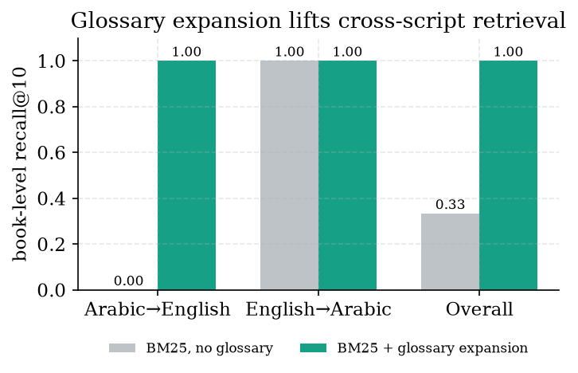
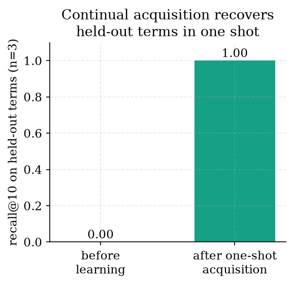

# A Self-Extending Bilingual Glossary for Offline Cross-Script Retrieval: Continual, Label-Free Term Acquisition Without Model Weight Updates

**Ayman Kazim Yousef**
Undergraduate Student, Department of Artificial Intelligence Engineering, AlSafwa University, Karbala, Iraq
ORCID: 0009-0006-7409-9367 · kazimayemn@gmail.com

**Keywords:** cross-lingual information retrieval; query expansion; bilingual lexicon; continual learning; on-device retrieval; Arabic–English

---

## Abstract

In a multilingual personal-library retrieval system an Arabic query must sometimes be answered from an English book, and vice versa, yet lexical (BM25) retrieval cannot cross scripts: an Arabic query never matches an English passage, however relevant. Translating every query with a language model fixes this but is slow on a CPU and is an unacceptable per-query cost on an offline edge device. We present a **self-extending bilingual glossary**: a deterministic query-expansion layer that appends the other-language equivalents of any known domain term to the search query — instant, additive (recall only grows), and requiring no model call — coupled with a **continual, label-free acquisition loop** that grows the glossary from the user's own retrieval failures. When, and only when, same-language retrieval misses, a one-off language-model translation is invoked, and the resulting term pair is **persisted to a local lexicon**; thereafter that term is expanded deterministically, with no model in the query-time path ever again. The thing that changes over time is a bounded JSON term store, not any model weight: we frame this as *continual training of the retrieval layer, not the generator*. On the real deployed corpus, the static glossary lifts Arabic→English cross-script book-level recall from **0.0 to 1.0** (six queries; the cross-script floor for lexical retrieval is zero by construction), while English→Arabic retrieval is already at 1.0 (n=3) because Arabic technical books embed English terms — an asymmetry we report rather than average away. A held-out continual-learning probe rises from **0.0 to 1.0** after a single one-shot acquisition per term, with all subsequent retrieval deterministic and model-free. We also measure dense baselines (§6.6): a small on-device and a heavy (LaBSE) multilingual encoder *both* cross scripts at book-level recall 1.0, so we frame the glossary not as a dense competitor but as a near-free (~48 µs, no model) repair of the hybrid retriever's lexical half plus the continual loop. We are explicit about scope: the individual ingredients — dictionary-based cross-language retrieval and query expansion — are decades old; our contribution is the *acquisition mechanism and deployment regime* (continual, relevance-gated, label-free, persisted locally, fully offline, no LLM in the query-time hot path once learned), and our evaluation is a small deterministic book-level benchmark on one machine, not a large labelled cross-lingual IR study. The system and experiment scripts are released for reproduction.

---

## 1. Introduction

A student in Iraq typically owns a mixed library: Arabic textbooks on programming and mathematics alongside English textbooks on machine learning, economics, and security. A retrieval-augmented generation (RAG) system [11] that serves such a library must answer a question posed in one language from a book written in the other, because the only relevant source may be cross-lingual. The lexical half of a hybrid retriever — BM25 [18] over a fast sparse index [13] — cannot do this at all: BM25 matches surface tokens, and an Arabic query and an English passage share none, so the relevant English book scores zero for an Arabic query no matter how on-topic it is. The dense half *can* bridge scripts through a multilingual embedding space — and, as we measure in §6.6, even a small on-device encoder does so at book-level recall 1.0 — but it pays for this on every query: a multilingual encoder must be resident in memory and run for each query, and the entire corpus must be re-embedded and re-indexed, a real cost on an offline CPU device, whereas a lexical bridge is a microsecond dictionary lookup with no model at all. The reranker, moreover, can only reorder candidates the retriever surfaced, so if BM25 contributes nothing on a cross-script query the lexical half of the hybrid is simply wasted. Repairing the lexical half cheaply — so the hybrid does not lean entirely on the dense encoder for every cross-script query — is therefore the binding constraint we address.

The textbook remedy is to translate the query [15]. Translating *every* query with the local language model, however, costs one or more seconds of CPU time per query and is the wrong default for an interactive, offline device. We want the cross-script bridge to be paid for once per *term*, not once per *query*, and never paid again once a term is known.

### 1.1 From a fixed dictionary to a self-extending one

Dictionary-based cross-language information retrieval (CLIR) is one of the field's founding paradigms: expand the query with the dictionary equivalents of its terms and retrieve in the target language [16, 3, 17]. We adopt exactly this additive expansion as our query-time operator, and we make no claim of novelty for it. The difficulty with a *fixed* dictionary is coverage: a hand-built glossary is always missing the term the user actually needs, and on an offline device there is no way to consult an external resource.

Our move is to make the dictionary **self-extending**. The system already possesses a one-off escape hatch for a same-language miss: when a query retrieves nothing in its own language, the local model translates it once and retrieval is retried (the conditional cross-lingual fallback of the deployed system). We turn that escape hatch into a *teacher*. The translation it produces is not discarded after the query; the resulting term pair is **written to a local glossary**, so the next time any query contains that term it is expanded deterministically, instantly, and with no model call. The retrieval layer thus *learns the user's vocabulary over time* — continually, from the user's own retrieval failures, with no labels, no parallel corpus, and no model fine-tuning.

### 1.2 What we claim, and what we do not

We claim a specific *composition and deployment regime*, not a new retrieval operator. The composition is: (i) a deterministic, additive, recall-only bilingual query-expansion layer that boosts both BM25 and a small bi-encoder; (ii) a continual acquisition loop in which the supervision signal is the *retrieval failure itself* — a same-language miss — so no human labels, clicks, or parallel data are needed; (iii) persistence of learned pairs to a bounded **local lexicon**, so that learning is auditable, instantly revertible, and survives restarts; and (iv) a query-time hot path with **no language model in it** once a term is learned, making the mechanism fit an offline CPU device.

We do **not** claim that dictionary-based CLIR or query expansion is novel — both are decades old [16, 19, 10], and we cite them as the foundation we build on. We do **not** claim to beat a strong multilingual dense retriever: a large multilingual encoder [7] will cross scripts without any glossary, and we measure (§6.6) that both a small on-device and a heavy dense encoder already cross scripts at book level, so we position our layer not as a replacement for dense retrieval but as a cheap, interpretable, editable *complement* that repairs the lexical half of the hybrid retriever and carries the continual loop. We do **not** claim the bilingual lexicon is *induced* in the sense of unsupervised lexicon induction [4, 2]: those methods learn a whole dictionary offline in batch from embedding geometry; we learn pairs *online and incrementally from live misses*. And we are explicit that our evaluation is small: a deterministic **book-level** retrieval benchmark on one machine with a hand-built labelled query set, not a large passage-level labelled CLIR evaluation, and we measure retrieval recovery rather than end-to-end answer quality. We state these threats in full in Section 7.

### 1.3 Contributions

- **A self-extending bilingual glossary.** A deterministic, additive cross-script query-expansion layer (308 Arabic→English and 280 English→Arabic domain term pairs at deployment) that requires no model call at query time, coupled with a continual acquisition loop that grows it from usage (§4).
- **Relevance-gated, label-free acquisition.** The supervision is a same-language retrieval miss: the one-off translation that resolves the miss is captured as a term pair, so no labels, clicks, or parallel corpus are ever required, and the language model fires at most once per new term (§4.2).
- **Continual learning without weight updates.** The only state that changes over time is a bounded local JSON lexicon — auditable, revertible, CPU-only — sidestepping the stability–plasticity dilemma of weight-based continual learning entirely (§4.3).
- **A live cross-script evaluation with an honest asymmetry.** On the real corpus, the static glossary lifts Arabic→English book-level recall from 0.0 to 1.0; English→Arabic is already at 1.0 because Arabic technical books embed English terms — an asymmetry we report rather than hide; and a held-out continual-learning probe rises from 0.0 to 1.0 after one-shot acquisition per term (§6).
- **A reduced-to-practice, released artifact.** The offline system and the deterministic experiment scripts (`exp_p2_glossary.py`, `exp_p2b_ablation.py`, `exp_p2c_labse.py`) are released for reproduction.

### 1.4 Reproducibility

Every number is produced by deterministic scripts (`exp_p2_glossary.py` for the cross-script and continual results, `exp_p2b_ablation.py` for the glossary-size ablation, and `exp_p2c_labse.py` for the dense baselines) run by the author on the real corpus, using the system's own glossary (`cross_lingual_terms`), Arabic normaliser, and the bm25s engine [13]. Cross-script queries and their target books are a fixed, human-authored labelled set; the continual-learning probe uses fixed held-out terms verified absent from the static glossary, and acquisition writes the same in-memory entry the deployed `learn_term` produces — a prefix-stripped key and the *head word* of the one-off translation (e.g., اللوجستي → `logistic`) — without modifying the released lexicon. A reader pointing the script at the same corpus obtains the same recall figures.

## 2. Related Work

Our contribution sits at the intersection of five threads: dictionary-based CLIR, query expansion, bilingual lexicon induction, multilingual dense retrieval, and continual learning for retrieval. We position our work against each in turn.

### 2.1 Dictionary-based cross-language IR and query translation

CLIR addresses the query/document language mismatch, classically by translating the query through a bilingual dictionary and retrieving in the target language [15]. Pirkola [16] showed that query *structure* and dictionary setup decisively affect dictionary-based CLIR; Ballesteros & Croft [3] combined phrasal translation with expansion; and the Pirkola et al. [17] survey codified the problems, methods, and findings of the dictionary-based approach. Modern multi-stage neural CLIR establishes the retrieve-then-rerank recipe across languages [12], and zero-shot cross-lingual reranking with language models is most effective in-language and only competitive cross-lingually for capable multilingual models [1] — evidence that argues for keeping a cheap lexical cross-script bridge rather than relying on the reranker to repair a cross-lingual gap. Our query-time operator *is* dictionary-based expansion; we concede it openly. What is not present in this thread is *where the dictionary comes from over time*: these systems assume a fixed lexical resource, whereas ours extends itself from usage.

### 2.2 Query expansion

Additive query expansion to grow recall is among the oldest techniques in IR, from Rocchio's relevance feedback [19] to relevance-based language models such as RM3 [10]. Our expansion is a *lexical, cross-lingual, precomputed* analogue: it adds other-language equivalents rather than same-language reweighted terms, it requires no per-query feedback round-trip, and it adds no scoring overhead — properties that matter on a CPU edge device. We inherit the recall-only character (a term not in the glossary simply is not expanded; precision is protected downstream by the reranker).

### 2.3 Bilingual lexicon induction

A body of work *learns* bilingual dictionaries automatically: MUSE aligns monolingual embedding spaces without parallel data [4], and robust self-learning extends this to fully unsupervised mappings [2]. These methods are powerful but operate **offline, in batch**, from embedding geometry or corpora, producing a static dictionary. Our acquisition is the opposite in regime: **online and incremental**, driven by live retrieval failures rather than embedding alignment, requiring neither a parallel corpus nor an embedding-space mapping step — at the cost of learning only the terms the user actually needs, which for a personal library is precisely the right set.

### 2.4 Multilingual dense retrieval

The standard alternative to a lexical cross-script bridge is a multilingual dense retriever that embeds queries and passages of all languages into one space [9, 7], evaluated on benchmarks such as MIRACL [21]. We pre-empt the "just use a multilingual encoder" objection by *measuring* it (§6.6): on our cross-script set both a small on-device encoder and a heavy one (LaBSE [7]) reach book-level recall 1.0 — the dense path crosses scripts unaided, and even the small deployed encoder suffices at this granularity. We therefore do **not** position the glossary as a competitor to dense retrieval. Its role is narrower and cheaper: it repairs the *lexical* half of the hybrid retriever (BM25 from 0.0 to 1.0) at ~48 µs and no model, so for a cross-script query BM25 contributes real candidates to the Reciprocal-Rank-Fusion pool and the reranker instead of nothing; it is interpretable and editable; and it carries the continual-learning loop. Recent work also reports that cross-lingual retrieval is *especially* hard between different scripts [14], so a near-free lexical complement is worth having — particularly where a dense encoder is unavailable, too aggressively quantized to cross scripts, or evaluated at a stricter granularity than book level.

### 2.5 Continual learning and continual retrieval

Continual learning is overwhelmingly framed as defending model *weights* against catastrophic forgetting [6]. The closest recent sibling to our work in retrieval is CREAM [20], which performs continual retrieval over dynamic streaming corpora and is, like ours, label-free and self-improving — but it adapts *model parameters* (a soft memory and prototypes). The clean dividing line is therefore: CREAM updates weights; we update a JSON file. By moving the "learning" entirely into a bounded external lexicon we sidestep the stability–plasticity dilemma — there is no forgetting to defend against, no retraining cost, and any learned pair can be inspected or deleted by hand. Generative query expansion with multilingual language models [14] and HyDE [8] are the *model-in-the-loop* analogues of our expansion; we reduce their per-query model cost to a one-time-per-term cost by caching the model's output as a reusable term pair.

### 2.6 Distinction

The combination we occupy — deterministic dictionary expansion, *continually and label-freely extended from live retrieval misses*, persisted to a *bounded local lexicon* with *no model weight update* and *no language model in the query-time path once a term is learned*, on a *fully offline* device — is not, to our knowledge, described as a unit in any of these threads. Each leaves open exactly the property our composition supplies.

## 3. Problem Formulation

A tenant owns a corpus `C` of passages, each in a language `ℓ(c) ∈ {ar, en}`. A query `q` has language `ℓ(q)`. The relevant passages for `q` may be in either language; in particular the *only* relevant passages may satisfy `ℓ(c) ≠ ℓ(q)` (a cross-script need). The lexical retriever scores `BM25(q, c)`, which depends on shared surface tokens after normalization. For `ℓ(c) ≠ ℓ(q)` with disjoint scripts, the token overlap is essentially empty, so `BM25(q, c) ≈ 0` and cross-script recall through the lexical path is ≈ 0 by construction.

Let `D : term → term` be a bilingual glossary (a partial map in both directions). The expansion operator augments the query with the images of its known terms:
`expand(q) = q ⊕ { D(w) : w ∈ terms(q), w ∈ dom(D) }`,
where `⊕` is token concatenation. Because expansion only *adds* tokens, lexical recall is monotone: `BM25_recall(expand(q)) ≥ BM25_recall(q)`; a term absent from `D` simply contributes nothing. The cross-script bridge is then exactly the coverage of `D` over the query's terms: if a term linking `q` to its cross-language target is in `D`, the target becomes lexically matchable; otherwise it does not.

The deployment constraints rule out the obvious ways of maximizing `D`'s coverage:

- **Offline / on-device.** No external dictionary or translation service is reachable; `D` and any extension to it must live on the device.
- **CPU-bounded query latency.** A language-model translation per query (one or more seconds) is unacceptable as the default path; the model may be invoked only rarely.
- **Label-free.** A personal library arrives with no relevance judgments, no parallel corpus, and no click logs from which to learn translations.

The design problem is to maximize `D`'s effective coverage of the user's actual vocabulary under these constraints. Our answer is to seed `D` with a curated domain glossary and to **extend it continually** from the one signal the constraints do permit: the user's own same-language retrieval misses.

## 4. Method

### 4.1 The static glossary and the expansion operator

The deployed glossary `D` holds **308 Arabic→English** and **280 English→Arabic** domain term pairs spanning the library's subjects — programming, mathematics, machine learning, research/publishing, economics, security, and databases — with Arabic keys stored in the system's normalized form (tashkeel stripped; alef, ya, and ta-marbuta unified). `cross_lingual_terms(q)` returns the space-joined other-language equivalents of every known term in the normalized query, matching multi-word Arabic keys before (and in addition to) their single-word components — deduplication is on the appended English value, not on consumed tokens — peeling Arabic clitic prefixes before lookup, and consulting the forward map, the learned map (§4.2), and the reverse map in turn. The result is appended to the BM25 (and bi-encoder) query. The operator is deterministic, adds no model call, and is additive, so it can only help lexical recall.

### 4.2 Continual, relevance-gated acquisition

The acquisition loop turns a retrieval failure into a permanent glossary entry:

#### Algorithm 1 — Continual term acquisition

```
On query q from a tenant:
1  results ← retrieve(expand(q))            # deterministic glossary expansion first
2  if results ≠ ∅: return results            # same-language (or already-known) hit — no model
3  # same-language miss → the one-off escape hatch becomes a teacher
4  if q is a short, single-term query in language ℓ(q):
5      t ← LLM_translate(q)                  # the ONLY model call; cached, timeout-bounded
6      learn_term( strip_prefix(head(q)) → head(t) )  # prefix-stripped key → head word of t
7  return retrieve( translate-and-retry(q) ) # resolve THIS query via the fallback
```

`learn_term` writes a prefix-stripped Arabic key mapped to the head word of the translation to a local JSON lexicon (`data/learned_glossary.json`) under a few guards: it refuses to overwrite a curated entry, rejects degenerate pairs (keys shorter than 3 characters or translations longer than 60 characters), and stops at a bound of 5,000 learned pairs so the store cannot grow without limit. The supervision is entirely the miss in line 2 — no human ever labels a pair. From the next query onward, the learned term is expanded deterministically in line 1, so the model call in line 5 is paid *at most once per term, ever*.

### 4.3 Why this is continual learning of the retrieval layer

The system's behaviour on cross-script queries improves monotonically over its lifetime as `D` grows, which is the defining property of continual learning — but the improvement is realized by accumulating entries in a bounded external lexicon, not by updating model weights. This has three consequences that weight-based continual learning cannot offer on an offline device. There is **no catastrophic forgetting** to defend against, because adding a pair cannot degrade any existing pair. The learned state is **auditable and revertible**: every pair is a human-readable line that can be inspected, corrected, or deleted. And the cost is **CPU-trivial**: an append to a JSON file, with no gradient step, no GPU, and no retraining. We therefore describe the mechanism as *continual training of the retrieval layer rather than of the generator* — the feasible form of lifelong adaptation for a fully-offline system built on a frozen local model.

## 5. System and Implementation

The glossary layer is part of `maktaba-web-local`'s hybrid retriever. `prepare_query` normalizes the query and appends `cross_lingual_terms(q)` before both the BM25 and the dense search, so a known cross-script term reaches passages in the other language through *both* paths; Reciprocal Rank Fusion [5] then merges the lexical and dense rankings and the cross-encoder reranks. The acquisition hook lives in the conditional translation path `_translate_query`: when a short single-term query is translated to resolve a same-language miss, `learn_term` is called with the normalized source term and the translation, persisting the pair. The learned lexicon is loaded once at startup and consulted on every subsequent query at no model cost. The whole layer runs on CPU; the only component that touches the language model is the rare, cached, timeout-bounded translation that also seeds learning, and the system degrades gracefully (it simply skips expansion) if the model is unavailable.

## 6. Evaluation

### 6.1 Setup

**Corpus.** We evaluate on the dominant tenant of the real deployed library, which owns both English books (machine learning, economics, AI-search, scientific publishing, databases, physics) and Arabic books (programming basics, partial fractions) — the bilingual mix that creates genuine cross-script needs.

**Cross-script query set.** A fixed, human-authored labelled set of nine queries whose relevant book is in the *other* language: six Arabic→English queries (e.g., "الشبكة العصبية التوليدية" → the generative-deep-learning book; "الحوافز الاقتصادية" → the economics book; "النشر العلمي ومعامل التأثير" → the scientific-publishing book) and three English→Arabic queries (e.g., "partial fractions" → الكسور الجزئيه; "programming variable and function" → اساسيات البرمجة). A query *hits* if any passage of its target book appears in the top-10.

**Continual-learning probe.** Three single-term Arabic queries whose translations are absent from the static glossary and whose English equivalents are distinctive to a target book — "الانتروبيا" (entropy), "الكامن" (latent), "اللوجستي" (logistic) — each verified absent from the static map. (The deployed acquisition persists a prefix-stripped key and the *head word* of the one-off translation, so "اللوجستي" is stored as `logistic`; we replicate that exactly.) We measure book-level recall before learning and after one-shot acquisition of each pair.

### 6.2 The static glossary turns the cross-script floor into a ceiling

**Table 1 — Cross-script book-level recall@10, without vs. with glossary expansion.**

| Direction | n | recall without glossary | recall with glossary |
|-----------|:-:|:-----------------------:|:--------------------:|
| Arabic → English | 6 | 0.00 | **1.00** |
| English → Arabic | 3 | 1.00 | 1.00 |
| **Overall** | 9 | 0.333 | **1.000** |

For Arabic→English the unexpanded lexical recall is **exactly zero** — the cross-script floor for lexical retrieval, since no Arabic query token can match an English passage — and glossary expansion lifts it to **1.0**: every Arabic query, once augmented with the English equivalents of its terms, retrieves its English target book. The English→Arabic direction is already at 1.0 *without* the glossary, and this is the honest asymmetry of the result: Arabic technical books embed English terms verbatim (code identifiers, formulae, transliterated loanwords such as "variable", "function", "partial fractions"), so an English query already matches them lexically, whereas English books contain no Arabic. We report this rather than average it away: the glossary's measured lift is concentrated where the cross-script floor is genuinely zero (Arabic→English), and is redundant where the corpus already provides a lexical bridge (English→Arabic). The overall recall rises from 0.333 to 1.0.



### 6.3 Continual acquisition recovers held-out terms in one shot

**Table 2 — Held-out continual-learning probe (book-level recall@10).**

| Stage | recall | detail |
|-------|:------:|--------|
| Before learning (term absent from glossary) | 0.00 | all three Arabic queries miss their English target |
| After one-shot acquisition | **1.00** | "الانتروبيا"→entropy, "الكامن"→latent, "اللوجستي"→logistic each now retrieve the target |

Before acquisition, the three held-out Arabic terms produce no expansion (they are absent from the static glossary) and the Arabic queries miss their English target books entirely. After a single acquisition per term — the one-off translation that the system's fallback would invoke on the miss, persisted by `learn_term` — every query retrieves its target, and does so *deterministically and model-free* on every subsequent query. This is the continual loop in miniature: a miss today becomes a permanent, zero-cost cross-script bridge tomorrow.



### 6.4 Glossary-size ablation: graceful scaling

How much of the hand-built glossary is needed? We subsample the static Arabic→English map to fractions of its 308 entries (a deterministic length-sorted prefix) and re-measure Arabic→English book-level recall@10 on the six cross-script queries.

| Glossary present | entries | Arabic→English recall@10 |
|:----------------:|:-------:|:------------------------:|
| 0 % | 0 | 0.00 |
| 25 % | 77 | 0.83 |
| 50 % | 154 | 0.83 |
| 75 % | 231 | 1.00 |
| 100 % | 308 | 1.00 |

Recovery scales gracefully with coverage: even a quarter of the glossary lifts cross-script recall from the zero floor to 0.83, and three-quarters reaches 1.0. This quantifies the marginal value of coverage and motivates the continual loop (§4.2), whose role is precisely to fill the remaining coverage gap from the user's own usage rather than from ever-larger manual curation.

### 6.5 Cost

Expansion is a dictionary lookup over the query's tokens — a measured median **48 µs** per query, with no model call. Acquisition costs one language-model translation, paid at most once per new term and amortized to zero over that term's future occurrences; the persisted lexicon is a bounded JSON file (≤ 5,000 pairs) loaded once at startup. There is no training step, no GPU, and no per-query model call once a term is known.

### 6.6 Dense multilingual-encoder baselines (the "why not just use an encoder?" question)

Dense retrievers cross scripts through a shared embedding space, so the obvious objection is to skip the glossary entirely. We measure it on the *same* corpus and the *same* labelled cross-script queries, embedding every chunk and indexing with FAISS, for the system's own small on-device encoder (`paraphrase-multilingual-MiniLM-L12-v2`, ~118 M) and a heavy multilingual encoder (LaBSE [7], ~471 M / ~1.8 GB).

**Table 3 — Cross-script book-level recall@10 by method (same corpus, same queries).**

| Method | AR→EN | EN→AR | per-query cost | model |
|--------|:-----:|:-----:|----------------|-------|
| BM25, no glossary | 0.00 | 1.00 | ~µs | none |
| **BM25 + glossary (this paper)** | **1.00** | 1.00 | +48 µs | none (308/280-pair map) |
| Dense — MiniLM (small, deployed) | 1.00 | 1.00 | ~16 ms/query | ~118 M |
| Dense — LaBSE (heavy) | 1.00 | 1.00 | ~22 ms/query | ~471 M / 1.8 GB |

The honest result is that **all three cross-script methods reach book-level recall 1.0**; only lexical-only BM25 sits at the structural floor of 0.0. Two consequences, stated plainly. First, the glossary is **not** the sole way to cross scripts — the dense path does so on its own, and even the *small* deployed encoder suffices at this granularity, with the heavy 1.8 GB LaBSE buying *no* book-level gain over it; we make no claim that the glossary beats dense retrieval. Second, what the glossary *does* contribute is precise and cheap: it repairs the **lexical half** of the hybrid retriever — BM25 goes 0.0→1.0, so a cross-script query yields real candidates to the RRF fusion pool and the reranker rather than nothing — at **~48 µs and no model**, versus a per-query dense encode (16–22 ms) over a model that must also embed and index the entire corpus (here 92 s and 453 s respectively). With the continual loop (§4.2) and its interpretability/editability, the glossary is best read as a near-free lexical complement on the cost/accuracy frontier. We flag the converse honestly: **at this lenient book-level metric the glossary's *net* benefit over dense-alone is nil** — its distinctive value lies in the fusion contribution, in interpretability/editability, and in settings (passage-level granularity, dense-unavailable or heavily-quantized devices) that this small benchmark does not isolate.

## 7. Discussion, Limitations, and Threats to Validity

### 7.1 What the results do and do not show

They show that a deterministic glossary converts the zero cross-script floor of lexical retrieval into full book-level recall for Arabic→English on this corpus, that the English→Arabic direction is already bridged by embedded English terms, and that the continual loop recovers held-out terms in one shot at no query-time model cost. They do **not** show a passage-level or end-to-end answer-quality result, nor that the mechanism beats a strong multilingual dense retriever; they characterize the *mechanism and its cost*, not deployment-wide quality.

### 7.2 Limitations and threats to validity

We treat the following as genuine threats, not caveats to be minimized.

- **Tiny labelled set, book-level metric.** Nine cross-script queries and three held-out terms, scored at the granularity of *which book* is retrieved, are enough to demonstrate the mechanism (a zero floor lifted to one) but not to estimate a population recall. Book-level recall is also lenient: it does not measure whether the *right passages* within the book are surfaced. A larger, passage-level, human-judged cross-lingual set is the necessary next step, and is the single thing most likely to temper the headline 1.0.
- **The English→Arabic baseline is already 1.0.** Because Arabic technical books embed English terms, the glossary's measured benefit is asymmetric and concentrated on Arabic→English. We do not claim a symmetric gain; on corpora of *prose* Arabic with no embedded English, we would expect the English→Arabic floor to drop and the glossary to help there too, but we have not measured that.
- **The static glossary is hand-curated for these domains.** Its 308/280 pairs were authored for this library's subjects; coverage of an out-of-domain library would be lower, which is precisely the gap the continual loop is meant to close — but the loop's real-world accumulation we have *not* observed at scale (the deployed learned lexicon is currently empty), so the continual benefit is demonstrated by construction, not by a longitudinal deployment study.
- **Acquisition depends on the local model's translation.** A learned pair is only as good as the one-off model translation that produced it; a mistranslation persists as a bad expansion until corrected. The guards (length limits, no-overwrite of curated entries, a size bound) reduce but do not eliminate this; the auditability of the lexicon is the mitigation (a human can delete a bad pair), but we do not measure acquisition precision here.
- **Single-term acquisition only.** The loop learns from short single-term queries, which keeps acquired pairs clean but means multi-word or phrasal cross-script gaps are not learned automatically.
- **Semantic drift and the absence of internal self-correction.** Because learning is label-free and no model weights change, a wrong acquired pair (from a mistaken one-off translation) persists as a bad expansion, and the system has no internal mechanism to *re-judge* a learned pair from later evidence — the classic semantic-drift risk of weight-free continual learning. We mitigate but do not eliminate it: the store is bounded and evictable, every pair is a human-readable line that can be inspected, corrected, or deleted, and expansion is strictly *additive* and filtered downstream by the reranker and the relevance gate, so a spurious expansion widens recall but rarely changes the final answer. A principled self-correction — demoting a learned pair whose expansions are never reranked into the kept set — is future work.
- **Adversarial and homograph inputs are out of scope.** We assume benign queries and documents; we do not study inputs crafted to poison the learned lexicon or to exploit cross-script homographs. The dynamic recalibration of the downstream relevance cutoff under data drift is handled by the companion self-calibrating gate, not by this layer.

### 7.3 Ethics and privacy

Learning happens entirely on-device from the user's own queries; no query, translation, or learned pair leaves the machine, and the lexicon is a local file the user can inspect or delete. The mechanism adds no telemetry and no external dependency at query time.

## 8. Conclusion and Future Work

We presented a self-extending bilingual glossary for offline cross-script retrieval: a deterministic, additive, model-free query-expansion layer coupled with a continual, label-free acquisition loop that grows the glossary from the user's own retrieval misses and persists it to a bounded local lexicon — continual learning of the retrieval layer with no model weight update and no language model in the query-time path once a term is known. On the real corpus the static glossary lifts Arabic→English cross-script book-level recall from 0.0 to 1.0 (English→Arabic is already bridged by embedded English terms), and a held-out probe rises from 0.0 to 1.0 after one-shot acquisition per term. Future work follows from the limitations: (i) a large, passage-level, human-judged cross-lingual benchmark; (ii) a longitudinal deployment study of the learned lexicon's real accumulation and its acquisition precision; (iii) phrasal and multi-word acquisition; and (iv) a measured comparison against, and combination with, a small on-device multilingual dense retriever.

## Declarations

**Competing interests.** The author declares no competing interests.

**Funding.** This research received no specific grant from any funding agency in the public, commercial, or not-for-profit sectors.

**Data and Code Availability.** The `maktaba-web-local` system and the deterministic experiment scripts (`exp_p2_glossary.py`, `exp_p2b_ablation.py`, `exp_p2c_labse.py`) that regenerate Tables 1–3 are released openly; results reproduce from a pinned commit. Because library contents are private user data, the artifact provides the scripts, the glossary, and the labelled query set needed to reproduce the methodology on a comparable corpus rather than redistributing private content.

---

## References

[1] Adeyemi, M., Oladipo, A., Pradeep, R., & Lin, J. (2024). Zero-shot cross-lingual reranking with large language models for low-resource languages. *Proc. 62nd ACL (Vol. 2: Short Papers)*, 650–656. https://doi.org/10.18653/v1/2024.acl-short.59

[2] Artetxe, M., Labaka, G., & Agirre, E. (2018). A robust self-learning method for fully unsupervised cross-lingual mappings of word embeddings. *Proc. 56th ACL (Vol. 1)*, 789–798. https://doi.org/10.18653/v1/P18-1073

[3] Ballesteros, L., & Croft, W. B. (1997). Phrasal translation and query expansion techniques for cross-language information retrieval. *Proc. 20th ACM SIGIR*, 84–91. https://doi.org/10.1145/258525.258540

[4] Conneau, A., Lample, G., Ranzato, M., Denoyer, L., & Jégou, H. (2018). Word translation without parallel data. *Proc. ICLR*. arXiv:1710.04087

[5] Cormack, G. V., Clarke, C. L. A., & Büttcher, S. (2009). Reciprocal rank fusion outperforms Condorcet and individual rank learning methods. *Proc. 32nd ACM SIGIR*, 758–759. https://doi.org/10.1145/1571941.1572114

[6] De Lange, M., Aljundi, R., Masana, M., Parisot, S., Jia, X., Leonardis, A., Slabaugh, G., & Tuytelaars, T. (2022). A continual learning survey: Defying forgetting in classification tasks. *IEEE TPAMI*, 44(7), 3366–3385. https://doi.org/10.1109/TPAMI.2021.3057446

[7] Feng, F., Yang, Y., Cer, D., Arivazhagan, N., & Wang, W. (2022). Language-agnostic BERT sentence embedding. *Proc. 60th ACL (Vol. 1)*, 878–891. https://doi.org/10.18653/v1/2022.acl-long.62

[8] Gao, L., Ma, X., Lin, J., & Callan, J. (2023). Precise zero-shot dense retrieval without relevance labels (HyDE). *Proc. 61st ACL (Vol. 1)*, 1762–1777. https://doi.org/10.18653/v1/2023.acl-long.99

[9] Karpukhin, V., Oğuz, B., Min, S., Lewis, P., Wu, L., Edunov, S., Chen, D., & Yih, W. (2020). Dense passage retrieval for open-domain question answering. *Proc. EMNLP 2020*, 6769–6781. https://doi.org/10.18653/v1/2020.emnlp-main.550

[10] Lavrenko, V., & Croft, W. B. (2001). Relevance-based language models. *Proc. 24th ACM SIGIR*, 120–127. https://doi.org/10.1145/383952.383972

[11] Lewis, P., et al. (2020). Retrieval-augmented generation for knowledge-intensive NLP tasks. *Advances in NeurIPS 33*, 9459–9474.

[12] Lin, J., Alfonso-Hermelo, D., Jeronymo, V., Kamalloo, E., Lassance, C., Nogueira, R., Ogundepo, O., Rezagholizadeh, M., Thakur, N., Yang, J.-H., & Zhang, X. (2023). Simple yet effective neural ranking and reranking baselines for cross-lingual information retrieval. arXiv:2304.01019. https://doi.org/10.48550/arXiv.2304.01019

[13] Lu, X. (2024). BM25S: Orders of magnitude faster lexical search via eager sparse scoring. arXiv:2407.03618

[14] Macmillan-Scott, O., Goworek, R., & Özyiğit, E. B. (2025). Generative query expansion with multilingual LLMs for cross-lingual information retrieval. arXiv:2511.19325. https://doi.org/10.48550/arXiv.2511.19325

[15] Nie, J.-Y. (2010). *Cross-Language Information Retrieval*. Synthesis Lectures on Human Language Technologies. Morgan & Claypool. https://doi.org/10.2200/S00266ED1V01Y201005HLT008

[16] Pirkola, A. (1998). The effects of query structure and dictionary setups in dictionary-based cross-language information retrieval. *Proc. 21st ACM SIGIR*, 55–63. https://doi.org/10.1145/290941.290957

[17] Pirkola, A., Hedlund, T., Keskustalo, H., & Järvelin, K. (2001). Dictionary-based cross-language information retrieval: Problems, methods, and research findings. *Information Retrieval*, 4(3–4), 209–230. https://doi.org/10.1023/A:1011994105352

[18] Robertson, S., & Zaragoza, H. (2009). The probabilistic relevance framework: BM25 and beyond. *Foundations and Trends in Information Retrieval*, 3(4), 333–389. https://doi.org/10.1561/1500000019

[19] Rocchio, J. J. (1971). Relevance feedback in information retrieval. In G. Salton (Ed.), *The SMART Retrieval System: Experiments in Automatic Document Processing* (pp. 313–323). Prentice-Hall.

[20] Son, H., Kang, H., Kim, S., Ho, S., Kang, S., Lee, D., & Yoon, S. (2026). CREAM: Continual retrieval on dynamic streaming corpora with adaptive soft memory. *Proc. 32nd ACM SIGKDD (KDD '26)*. arXiv:2601.02708. https://doi.org/10.48550/arXiv.2601.02708

[21] Zhang, X., Thakur, N., Ogundepo, O., Kamalloo, E., Alfonso-Hermelo, D., Li, X., Liu, Q., Rezagholizadeh, M., & Lin, J. (2023). MIRACL: A multilingual retrieval dataset covering 18 diverse languages. *Transactions of the ACL*, 11, 1114–1131. https://doi.org/10.1162/tacl_a_00595
