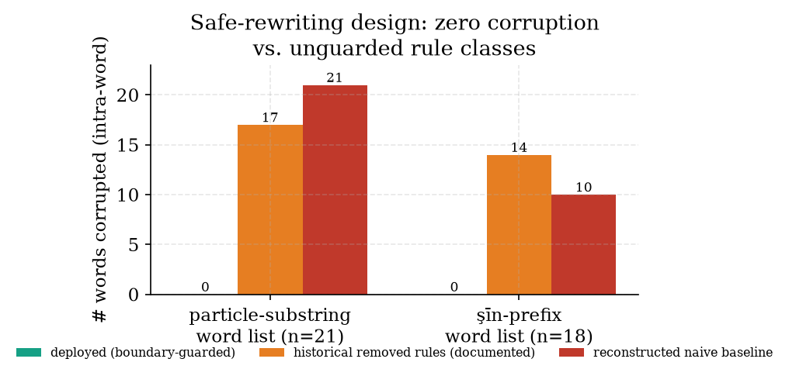

# Safe Deterministic Post-Hoc Dialect Rewriting: Turning Modern-Standard-Arabic Language-Model Output into Iraqi Arabic Without Corrupting the Text

**Ayman Kazim Yousef**
Undergraduate Student, Department of Artificial Intelligence Engineering, AlSafwa University, Karbala, Iraq
ORCID: 0009-0006-7409-9367 · kazimayemn@gmail.com

**Keywords:** Arabic dialect; Iraqi Arabic; text rewriting; low-resource NLP; retrieval-augmented generation; model-agnostic post-processing

---

## Abstract

A local language model answering a retrieval-augmented question in Arabic almost always replies in Modern Standard Arabic (MSA), while the users of a study assistant in Iraq expect Iraqi colloquial Arabic. Fine-tuning the generator per dialect is infeasible on an offline device, and prompting alone is unreliable. We present a **deterministic, post-hoc, model-agnostic** rewriting layer that converts MSA model output into Iraqi Arabic *after* generation: morphological transformations (future tense, passive/auxiliary constructions, MSA verbs to their Iraqi equivalents), a length-sorted MSA→Iraqi substitution map of **321** deployed entries hand-authored from analysis of the IADD and IA2D Iraqi-dialect datasets and the Georgetown *Dictionary of Iraqi Arabic*, and a conservative spacing fixer, with code spans preserved verbatim. The central methodological contribution is a **safe-rewriting design**: we report that earlier rules which split on particle substrings, and rules that rewrote attached future-tense prefixes, corrupted ordinary words by altering letters *inside* them (the implementation records corruption of 17 of 21 and 14 of 18 common words respectively), and we replace them with boundary-guarded rules — using Arabic-letter negative look-behind and look-ahead — that *cannot* change a letter inside a word. We verify on a common-vocabulary list that the deployed processor introduces **zero** intra-word corruption (0/21 and 0/18), whereas a reconstructed naive baseline corrupts **21/21 and 10/18** on the same words; that the layer rewrites every one of fifteen MSA test sentences (≈ 54 % of tokens changed) into recognizably Iraqi forms; and that the transformation is idempotent and code-preserving. We are explicit about scope: the components — rule-based dialect conversion and dialect lexicons — are not new, and we have not run a human fluency or adequacy study, so we measure *safety, coverage, and stability*, not perceived dialect quality. The contribution is the specific tuple — deterministic, post-hoc, model-agnostic, RAG-output, Iraqi, with a documented corruption-avoidance methodology — together with the released artifact.

---

## 1. Introduction

Iraqi students using an Arabic study assistant expect to be answered the way they speak: in Iraqi Arabic — هسه (now), ماكو (there isn't), شلون (how), هواية (a lot), گاع (completely) — not in the formal Modern Standard Arabic (MSA) that a general-purpose language model produces by default. This default is well documented: large models are reluctant to generate dialectal Arabic and revert to MSA unless strongly steered [14], and major dialectal benchmarks omit Iraqi entirely [11], reflecting how low-resource it is relative to Egyptian, Levantine, or Gulf Arabic. For a fully-offline study assistant built on a frozen local model, the two obvious routes to dialectal output are both blocked: fine-tuning the generator per dialect is infeasible on the device and would have to be redone for every model swap, and prompting the model to "answer in Iraqi" is unreliable and, when it does fire, tends to leak dialect greetings into otherwise technical answers.

We take a different route: leave the generator untouched and **rewrite its output**. After the model produces an MSA answer, a deterministic post-processing layer converts it to Iraqi Arabic. Because the layer is downstream of generation and depends on nothing about the model, it is **model-agnostic** — it works identically whether the answer came from a 3-billion- or a 14-billion-parameter local model, or from any future replacement — and it is **auditable and reproducible**, because every transformation is a fixed rule rather than a sample from a network.

### 1.1 The hazard that defines the design: rewriting that corrupts

The naive version of such a layer is dangerous in a way specific to Arabic. Arabic is written without inter-word spaces inside a word but with rich clitic attachment, and many dialect markers are short particles — لا, على, مع, في, and the future prefix سـ — that also appear as *substrings of perfectly ordinary words*. A rule that "inserts a space before على" or "rewrites a leading سـ to راح" cannot, without a lexicon, tell the glued colloquial form from the innocent word that merely contains those letters. Applied blindly, such rules shatter common vocabulary: in our reconstructed unguarded baseline (§6.2) الاقتصاد ("the economy") becomes "ا لا قتصاد", المعلومات ("the information") becomes "ال مع لومات", and سيارة ("car") becomes "راح يارة". The implementation we study records that an earlier particle-splitting rule set corrupted **17 of 21** common words and an attached-future-prefix rule set corrupted **14 of 18**, and that both were consequently removed. The engineering lesson — and the methodological core of this paper — is that for a rule-based rewriter operating on a script with clitic attachment, **safety must be designed in**: a rule must be provably unable to alter a letter inside a word, even at the cost of dialect coverage.

### 1.2 What we claim, and what we do not

We claim a specific *tuple* and a *methodology*. The tuple is a dialectization layer that is **deterministic** (no sampling), **post-hoc** (applied after generation), **model-agnostic** (independent of the generator), embedded in a **RAG** answer pipeline, targeting **Iraqi** Arabic specifically, with a **documented corruption-avoidance design**. The methodology is the safe-rewriting principle: prefer boundary-guarded rules that cannot touch intra-word letters, measure corruption on a held-out common-vocabulary list, and trade dialect coverage for zero corruption where the two conflict.

We do **not** claim to be the first to convert between MSA and a dialect, nor the first rule-based Arabic dialect system: rule-based dialect machine translation exists [15], though predominantly in the *opposite* direction (dialect→MSA, as preprocessing), and dialect lexicons exist [8]. We do **not** claim a neural or learned model — the layer is intentionally a finite set of rules and a map. Most importantly, we do **not** claim a *quality* result: we have not run a human study of whether speakers judge the output to be fluent, adequate, or natural Iraqi, so we measure **safety** (no corruption), **coverage** (how much MSA is converted), and **stability** (idempotence, code preservation) — *not* perceived dialect quality, which is the principal open gap. We also do not claim the rules capture Iraqi syntax or morphology in full; they are a lexical-and-shallow-morphological surface rewriter. We state these threats in Section 7.

### 1.3 Contributions

- **A model-agnostic post-hoc dialectization layer for RAG.** A deterministic rewriter that converts MSA model output to Iraqi Arabic after generation, independent of the generator, comprising 22 morphological rules, a 321-entry length-sorted substitution map, and a conservative spacing fixer, with code spans preserved (§4).
- **A safe-rewriting methodology, with a documented failure motivating it.** We articulate and verify the principle that rewriting rules on a clitic-attaching script must be boundary-guarded so they cannot alter intra-word letters; the design is motivated by a recorded failure (17/21 and 14/18 common words corrupted by the removed rules) and realized with Arabic-letter negative look-behind/look-ahead guards (§4.1, §6.2).
- **A verified safety, coverage, and stability evaluation.** On a common-vocabulary list the deployed processor corrupts 0/21 and 0/18 words while a reconstructed naive baseline corrupts 21/21 and 10/18; on fifteen MSA sentences it rewrites all of them (≈ 54 % of tokens) into Iraqi forms; and the transformation is idempotent and code-preserving (§6).
- **Provenance and a resource note.** The map is hand-authored from analysis of the IADD dataset [17], the IA2D Iraqi-tweet corpus [5], and the Georgetown *Dictionary of Iraqi Arabic* [16] (the datasets inform term selection and supply the few-shot example sentences; they are not used to auto-derive map entries), and we document Iraqi's low-resource status relative to other Arabic dialects (§4.1, §6).
- **A reduced-to-practice, released artifact.** The layer and the deterministic experiment script (`exp_p3_dialect.py`) are released for reproduction.

### 1.4 Reproducibility

Every number is produced by a deterministic script (`exp_p3_dialect.py`) that calls the system's own `dialectize` function on fixed word lists and sentences, with no randomness. The corruption counts, coverage rate, idempotence check, code-preservation check, and map statistics regenerate exactly. (The substitution map itself is a versioned, distributed artifact, not regenerated by a build script — `build_dialect.py` seeds an initial map that was subsequently hand-expanded to the 321 deployed entries; the experiment scripts reproduce the *measurements* against the distributed map.) The reconstructed naive baseline is included in the script so a reader can see precisely which rule class the deployed design avoids.

## 2. Related Work

Our contribution sits at the intersection of three threads: Arabic dialect identification and resources, dialect conversion and generation, and dialect-aware conversational/RAG systems. We position our work against each in turn.

### 2.1 Arabic dialect identification and resources

Nuanced Arabic dialect identification has been driven by the NADI shared tasks, which establish country- and province-level dialect labelling, including Iraqi [1, 3, 4], built on Arabic transformer encoders such as AraBERT [6] and ARBERT/MARBERT [2]. Open Arabic processing tooling [12] and Habash's foundational treatment [9] underpin this line, and the MADAR corpus and lexicon provide a concept-aligned multi-dialect lexical resource across 25 cities plus MSA [8]. Our work *consumes* this infrastructure — the substitution map is built from Iraqi-labelled data [17, 5] and a dialect dictionary [16] — rather than contributing a new identifier or corpus. The distinction from MADAR is one of purpose: MADAR is a research lexicon aligned by concept; ours is a deployment-engineered map authored for *safe in-place substitution*, length-sorted and boundary-guarded so it can be applied to running text without corrupting it.

### 2.2 Dialect conversion and generation

Rule-based dialect machine translation has precedent: ELISSA [15] is a rule-based, morphological-transfer system that covers several dialects, Iraqi among them — but it translates **dialect→MSA**, as a preprocessing step to feed MSA NLP tools, the inverse of our direction. The NADI 2023 task added dialect→MSA machine translation subtasks [4], again the opposite direction. Neural MSA→dialect *generation* exists but requires fine-tuning the generator per dialect, the path our offline, frozen-model setting rules out. Our direction (MSA→Iraqi) applied as a deterministic, generator-agnostic rewrite of model output is not, to our knowledge, represented in this thread; and unlike a neural converter it offers guarantees (determinism, idempotence, no intra-word corruption) that a sampled model cannot.

### 2.3 Dialect-aware conversational and RAG systems

That language models default to MSA and must be coaxed into dialect is established empirically: AL-QASIDA analyzes model quality in dialectal Arabic and finds the MSA-reversion tendency mitigated, partially, by few-shot prompting [14]; AraDiCE benchmarks dialectal and cultural capability and notably does *not* include Iraqi as a covered dialect [11], evidencing the resource gap. At the system level, DziriBOT is a RAG-based conversational agent for a low-resource Arabic dialect (Algerian) [7], the nearest system-level neighbour, but it is neural and centred on understanding/generation rather than a deterministic output-rewriting layer. We position our work as complementary: rather than a new dialect model or agent, we contribute a deterministic, auditable, model-agnostic *output* layer and the safe-rewriting methodology behind it, which a neural pipeline cannot guarantee and which transfers to any frozen generator.

### 2.4 Distinction

The combination — deterministic, post-hoc, model-agnostic MSA→Iraqi rewriting embedded in a RAG pipeline, designed around a documented corruption-avoidance principle for a clitic-attaching script — is, to our knowledge, not present in the dialect-conversion, lexicon, or dialect-RAG literature. The safe-rewriting methodology in particular (boundary-guarded rules, corruption measured on held-out vocabulary, coverage traded for safety) we could find no precedent for, and we frame it as transferable to rule-based low-resource text rewriting beyond Iraqi.

## 3. Problem Formulation

A retrieval-augmented generation (RAG) pipeline [10] produces an answer string `a` in MSA. The goal is a rewrite `r(a)` in Iraqi Arabic that satisfies three requirements:

- **Safety.** `r` must not corrupt valid words: for any word `w` of `a` that is not a target of an intended transformation, `w` must appear unaltered in `r(a)`. Formally, `r` may delete, substitute, or re-space tokens only at token boundaries it can *prove*, never inside a word.
- **Coverage.** `r` should convert MSA forms that have Iraqi equivalents — lexical items (الآن→هسه), and shallow-morphological constructions (future tense, certain passive/verb forms).
- **Stability.** `r` should be idempotent (`r(r(a)) = r(a)`, so re-applying does no further damage) and structure-preserving (code spans and formulae left byte-identical).

The deployment constraints are: the generator is **frozen** and may be swapped, so `r` must be generator-independent; computation is **on-device** and must be cheap; and there is **no per-utterance human supervision**. These rule out fine-tuning and favour a deterministic rule layer. The tension is between coverage and safety: the most aggressive coverage rules (splitting on particle substrings, rewriting attached prefixes) are exactly the ones that violate safety on a script with clitic attachment, because a short dialect particle is indistinguishable, without a lexicon, from the same letters occurring inside an ordinary word. Our design resolves the tension in favour of safety.

## 4. Method

### 4.1 The safe-rewriting principle

The deployed rewriter applies, in order: (1) morphological transformations, (2) a word-substitution map, and (3) a spacing fixer; code spans are stashed before and restored after, so they are never touched. The safety requirement is enforced uniformly by **boundary guards**: every lexical and morphological rule is wrapped in an Arabic-letter negative look-behind and look-ahead, `(?<![ء-ي]) … (?![ء-ي])`, so it fires only when the matched form is a whole token — it is *structurally incapable* of inserting a space or substituting letters inside a longer word.

This principle was learned from failure, and the failure is instructive. An earlier version tried to repair word-merge artifacts by splitting on particle substrings (لا, على, مع, في, pronouns) and to express the future tense by rewriting an attached سـ prefix to راح. Neither could be guarded, because the particle and the prefix are legitimate substrings of countless ordinary words; the implementation records that the particle-splitting rules corrupted **17 of 21** common words (الاقتصاد→"الا قتصاد", المعلومات→"ال معلومات", الفهم→"الف هم") and the attached-prefix rules corrupted **14 of 18** (سيارة→"راح يارة", سياسة→"راح ياسة", سنوات→"راح نوات"). Both rule classes were removed. Future tense is now handled **only by whole-word, boundary-guarded forms**: complete future *tokens* in the substitution map (the five whole words سأشرح→راح أشرح, سأكمل→راح أكمل, سأوضح→راح أوضح, سأدي→راح, and سنتناول→راح نشوف), plus two boundary-guarded *morphological* rules — سوف before a verb (سوف + أ/ي/ت/ن → راح + that verb) and the whole word سيتم→راح يصير — each of which rewrites or replaces an *entire* token, so unlike the deleted prefix-*stripping* rule none can alter letters inside a word such as سيارة. Free-form word-merge repair is likewise abandoned in favour of keeping the input intact — a deliberate coverage sacrifice for zero corruption. The morphological layer that remains (22 rules) handles only transformations expressible at token boundaries: the future particle سوف before a verb (سوف + أ/ي/ت/ن → راح + verb), passive يتم/تتم/تم→يصير/تصير/صار, دعنا→خلنا, the verbs يتحدث/يتكلم→يحچي and يشير→يگول and يُعدّ→يعتبر, each guarded so it cannot bleed into a neighbouring word.

### 4.2 The substitution map

The map holds **321** MSA→Iraqi entries, of which **129 are multi-word** keys (up to three words). It is **length-sorted descending** so that longer phrases match before their sub-phrases (e.g., "لا يوجد"→ماكو is tried before "يوجد"→أكو), and every entry is applied through the same boundary guard as the morphological rules. The entries were built from Iraqi-labelled data — the IADD integrated dialect dataset [17] and the IA2D Iraqi-tweet corpus [5] — together with the Georgetown *Dictionary of Iraqi Arabic* [16] and manual curation, with social-media noise (hashtags, URLs, transliteration) filtered out so the map contains clean lexical pairs rather than corpus artefacts.

### 4.3 Few-shot examples, scoped to greetings

Separately from the deterministic rewrite, the system injects a small block of curated Iraqi examples into the model's system prompt to nudge generation toward dialectal phrasing for *conversational* turns. These examples are **scoped to greetings only**: an earlier unscoped version caused the model to inject greetings (شلونك؟ شخبارك؟) into the middle of technical answers, because it copied the few-shot greeting style into every reply. The scoping instruction explicitly forbids greetings inside technical answers. This is a prompting aid, not part of the deterministic guarantee; the safety and stability results below concern only the post-hoc rewriter.

## 5. System and Implementation

The rewriter is the final stage of `maktaba-web-local`'s answer pipeline: after the local model (a qwen2.5 model in our deployment) [13] streams an MSA answer grounded in retrieved passages, `dialectize` is applied before the text is shown. It stashes fenced and inline code spans behind placeholders, applies the 22 boundary-guarded morphological rules, then the 321-entry length-sorted substitution map (also guarded), then a two-rule spacing normalizer (a space after Arabic/Latin punctuation, and double-space collapse — neither of which can split a word), and finally restores the code spans verbatim. Patterns are compiled once at module load. The layer is pure CPU string processing, adds negligible latency, and is independent of which model produced the text, so it survives a model swap unchanged.

## 6. Evaluation

### 6.1 Setup

All measurements call the deployed `dialectize` on fixed inputs. **Safety** is measured on two common-vocabulary word lists chosen to contain the substrings the removed rules keyed on: 21 words containing particle substrings (الاقتصاد, المعلومات, الفهم, …) and 18 words beginning with سـ (سيارة, سياسة, سنوات, ستيفن, …). A word is *corrupted* if the output differs from the input by an inserted intra-word space or altered letters; for the deployed processor the two criteria coincide at zero, as it leaves every listed word byte-identical. We compare the deployed processor against a **reconstructed naive baseline** that implements the removed rule classes (unguarded particle-splitting and unguarded سـ→راح). **Coverage** is measured on fifteen MSA sentences containing mappable lexical and morphological forms, reporting the fraction of sentences altered and an approximate token-change rate. **Stability** checks idempotence on the same sentences and code-preservation on inputs mixing Arabic with fenced and inline code.

### 6.2 Safety: zero corruption, against a baseline that shatters words

**Table 1 — Intra-word corruption on common-vocabulary lists.**

| Rule set | particle list (n = 21) | سـ list (n = 18) |
|----------|:----------------------:|:----------------:|
| **Deployed (boundary-guarded)** | **0** | **0** |
| Reconstructed naive baseline | 21 | 10 |
| Documented historical (removed rules) | 17 | 14 |

The deployed processor corrupts **no** word on either list: every common word that merely *contains* a particle substring or *begins* with سـ passes through unchanged, because the boundary guards prevent any rule from firing inside it. The reconstructed naive baseline — implementing the unguarded rule classes — corrupts **all 21** particle words (e.g., الاقتصاد→"ا لا قتصاد", المعلومات→"ال مع لومات") and **10 of 18** سـ words (سيارة→"راح يارة", سياسة→"راح ياسة", سنوات→"راح نوات"). These are our own measurements on the reconstructed rules; the implementation additionally records that the *original* removed rules corrupted 17/21 and 14/18 — figures we cite from the source rather than re-derive, since the exact original rules are no longer in the codebase. Either way the conclusion is the same: the unguarded rule class is unsafe by construction, and the boundary-guarded design eliminates the hazard.



### 6.3 Coverage: all sentences dialectized

On the fifteen MSA test sentences the rewriter alters **15/15** (a 100 % sentence-change rate) and changes approximately **54 %** of tokens, producing recognizably Iraqi output. Representative rewrites:

| MSA input | Iraqi output |
|-----------|--------------|
| الآن لا يوجد كثير من الوقت لكن كل شيء جيد | هسه ماكو هواية من الوقت بس كلشي زين |
| كيف حالك يا صديقي | شلونك يا صاحبي |
| سوف يتم شرح الموضوع | راح يصير شرح الموضوع |
| دعنا نبدأ من البداية | خلنا نبدأ من البداية |
| المعلم يشير إلى أن المتغير مهم جداً | المعلم يگول إلى أن المتغير مهم كلش |
| أين الكتاب الذي تتحدث عنه | وين الكتاب الذي تحچي عنه |

The rewriter converts lexical items (الآن→هسه, لا يوجد→ماكو, كثير→هواية, لكن→بس, جيد→زين, صديقي→صاحبي, جداً→كلش, أين→وين), the future periphrasis (سوف يتم→راح يصير), the imperative دعنا→خلنا, and verbs (يشير→يگول, تتحدث→تحچي), while leaving function words and content it has no rule for (الموضوع, المتغير, الكتاب) untouched — the visible signature of a safe rewriter that changes only what it can prove. (These are general MSA prose sentences, not greetings: the greeting-scoping of §4.3 concerns only the optional few-shot *prompt* that nudges generation, whereas the deterministic rewriter evaluated here applies to *all* generated text regardless of topic or length.)

### 6.4 Stability: idempotent and code-preserving

The transformation is **idempotent** — `dialectize(dialectize(s)) = dialectize(s)` for all fifteen sentences (0 non-idempotent), so re-applying it (e.g., on cached text) does no further change — and **code-preserving**: on inputs mixing Arabic prose with fenced ```python``` blocks and inline `code` containing MSA words, every code span is returned byte-identical, because spans are stashed before any rule runs. Together these mean the layer is safe to apply unconditionally to model output, including output that contains code, formulae, or already-dialectal text.

**On cost.** `dialectize` is pure CPU string processing: a measured median **0.15 ms** per sentence and **35 ms** for a 9.6 KB multi-paragraph answer, with no model and no GPU — imperceptible in the token-streaming path, and trivially affordable on commodity on-device hardware.

### 6.5 Automatic dialectness: a negative result that motivates the human study

A natural question is whether an automatic metric could stand in for a human study. We tried the most direct one: Sentence-ALDi [18], a continuous estimator of dialectness (0 = MSA, 1 = fully dialectal), scoring each MSA sentence and its rewrite. The result is instructive and **negative**: mean dialectness did *not* rise — it was flat-to-slightly-lower (**0.55 → 0.49**), and only 2 of 15 rewrites rose by more than a noise margin (> 0.01; 4 rose at all), even though outputs such as "شلونك يا صاحبي" and "هسه ماكو هواية" are unambiguously Iraqi to a native speaker. The cause is not the rewriter but the metric: ALDi is trained on the Arabic Online Commentary corpus (Egyptian, Levantine, Gulf) and contains **no Iraqi**, so it does not register Iraqi markers (هسه, ماكو, شلون, گاع) as dialectal. This is itself a finding — **no off-the-shelf automatic dialectness metric validly covers Iraqi** — which both reinforces Iraqi's low-resource status (§1) and confirms that a blind human evaluation by Iraqi speakers, not an automatic proxy, is the necessary measure of dialect quality (§7.2). We report this negative result in full rather than substitute a metric that does not measure what it claims to.

## 7. Discussion, Limitations, and Threats to Validity

### 7.1 What the results do and do not show

They show that the deployed rewriter is *safe* (zero intra-word corruption where a naive baseline shatters words), has broad lexical/shallow-morphological *coverage* (all test sentences dialectized), and is *stable* (idempotent, code-preserving). They do **not** show that the output is *good* Iraqi as judged by speakers: we measure surface transformation, not fluency, adequacy, or naturalness. The headline of this paper is a *safety-and-engineering* result, not a dialect-quality result.

### 7.2 Limitations and threats to validity

We treat the following as genuine threats, not caveats to be minimized.

- **No human evaluation of dialect quality.** This is the single most important gap. We have not asked Iraqi speakers to rate the rewritten output for fluency, adequacy, or naturalness, so we cannot claim the output *reads* as good Iraqi — only that it is safely and substantially transformed. A speaker-judged study (adequacy/fluency, and comparison against the model's own dialect attempts and against a neural converter) is the necessary next step.
- **Coverage is measured by surface token change, on a small constructed set.** The 54 % token-change rate and 15/15 sentence rate are measured on fifteen sentences *constructed* to contain mappable forms; they demonstrate the mechanism fires, not the rewriter's coverage on naturally-generated RAG answers, which would be lower and which we have not measured.
- **The historical corruption figures are cited, not re-derived.** The 17/21 and 14/18 figures come from the implementation's own record of the removed rules; we reconstruct a naive baseline (measuring 21/21 and 10/18) to demonstrate the *failure class*, but the exact original rules are gone, so the historical figures are reported as documentation, not as our independent measurement.
- **A rule-based ceiling.** The layer is a lexical-and-shallow-morphological surface rewriter; it does not model Iraqi syntax, agreement, or deep morphology, and it will leave MSA constructions it has no rule for unchanged (visible in §6.3). Raising coverage by adding aggressive rules risks re-introducing the very corruption the design exists to prevent, so coverage is bounded by the safety constraint.
- **Single dialect, and no semantic repair.** The map and rules are Iraqi-specific (though the *methodology* transfers), and the rewriter cannot fix a wrong or hallucinated answer — it only changes register, so a safe rewrite of an incorrect answer is still incorrect.
- **Context-free substitution and homographs.** The map is context-insensitive: it converts a whole MSA token wherever it occurs. The boundary guards prevent *intra-word* corruption, but not *contextual* error — an MSA word that is also a proper noun, a quoted term, or a domain term in a given context will still be dialectized. The conservative, additive design and verbatim code-span preservation bound the damage (identifiers, code, and formulae are never touched), but true homograph- or context-aware rewriting would require the disambiguation we deliberately avoid for determinism and safety. Measuring the rate of contextual mis-conversions on natural answers is future work alongside the human study.
- **Adversarial inputs out of scope.** We assume benign model output; we do not study text crafted to trigger or evade the substitution rules, nor dialectization as an attack surface.

### 7.3 Ethics

The rewriter runs entirely on-device and changes only linguistic register, not content; it adds no telemetry. Dialectal output serves accessibility for users more comfortable in Iraqi than in MSA, but we note that register choice can carry social signals, and the layer is optional.

## 8. Conclusion and Future Work

We presented a deterministic, post-hoc, model-agnostic layer that rewrites MSA language-model output into Iraqi Arabic for a RAG study assistant, designed around a safe-rewriting principle: on a clitic-attaching script, rewriting rules must be boundary-guarded so they cannot alter letters inside a word, even at the cost of coverage. We verified that the deployed processor corrupts zero of 21 and zero of 18 common words where a reconstructed naive baseline corrupts 21 and 10 (and the removed rules historically 17 and 14); that it dialectizes all fifteen MSA test sentences (≈ 54 % of tokens); and that it is idempotent and code-preserving. Future work follows directly from the limitations: (i) a speaker-judged fluency/adequacy study, including comparison with the model's own dialect attempts and a neural converter; (ii) coverage measurement on naturally-generated RAG answers; (iii) carefully extending coverage (deeper morphology, more multi-word constructions) *within* the safety constraint; and (iv) generalizing the safe-rewriting methodology and the build pipeline to other low-resource dialects.

## Declarations

**Competing interests.** The author declares no competing interests.

**Funding.** This research received no specific grant from any funding agency in the public, commercial, or not-for-profit sectors.

**Data and Code Availability.** The `maktaba-web-local` system and the deterministic experiment script (`exp_p3_dialect.py`) that regenerates Table 1 and the coverage/stability checks are released openly and reproduce from a pinned commit. The substitution map is distributed with the system; the IADD and IA2D source datasets are available from their original authors [17, 5].

---

## References

[1] Abdul-Mageed, M., Zhang, C., Elmadany, A., Bouamor, H., & Habash, N. (2021). NADI 2021: The second nuanced Arabic dialect identification shared task. *Proc. Sixth Arabic NLP Workshop (WANLP)*, 244–259.

[2] Abdul-Mageed, M., Elmadany, A., & Nagoudi, E. M. B. (2021). ARBERT & MARBERT: Deep bidirectional transformers for Arabic. *Proc. 59th ACL-IJCNLP (Vol. 1)*, 7088–7105. https://doi.org/10.18653/v1/2021.acl-long.551

[3] Abdul-Mageed, M., Zhang, C., Elmadany, A., Bouamor, H., & Habash, N. (2022). NADI 2022: The third nuanced Arabic dialect identification shared task. *Proc. Seventh Arabic NLP Workshop (WANLP)*. arXiv:2210.09582

[4] Abdul-Mageed, M., Elmadany, A., Zhang, C., Nagoudi, E. M. B., Bouamor, H., & Habash, N. (2023). NADI 2023: The fourth nuanced Arabic dialect identification shared task. *Proc. ArabicNLP 2023*. arXiv:2310.16117

[5] Al-Jawad, M. M. H., Alharbi, H., Almukhtar, A. F., & Alnawas, A. A. (2022). Constructing Twitter corpus of Iraqi Arabic Dialect (CIAD) for sentiment analysis. *Scientific and Technical Journal of Information Technologies, Mechanics and Optics*, 22(2), 308–316. https://doi.org/10.17586/2226-1494-2022-22-2-308-316 (dataset released as IA2D)

[6] Antoun, W., Baly, F., & Hajj, H. (2020). AraBERT: Transformer-based model for Arabic language understanding. *Proc. 4th Workshop on Open-Source Arabic Corpora and Processing Tools (LREC)*, 9–15.

[7] Bechiri, A., & Lanasri, D. (2026). DziriBOT: A RAG-based conversational agent for the Algerian Arabic dialect. arXiv:2602.02270

[8] Bouamor, H., Habash, N., Salameh, M., Zaghouani, W., Rambow, O., Abdulrahim, D., Obeid, O., Khalifa, S., Eryani, F., Erdmann, A., & Oflazer, K. (2018). The MADAR Arabic dialect corpus and lexicon. *Proc. LREC 2018*, 3387–3396.

[9] Habash, N. Y. (2010). *Introduction to Arabic Natural Language Processing*. Synthesis Lectures on Human Language Technologies (Vol. 10). Morgan & Claypool. ISBN 978-1-59829-795-9.

[10] Lewis, P., Perez, E., Piktus, A., Petroni, F., Karpukhin, V., Goyal, N., Küttler, H., Lewis, M., Yih, W., Rocktäschel, T., Riedel, S., & Kiela, D. (2020). Retrieval-augmented generation for knowledge-intensive NLP tasks. *Advances in NeurIPS 33*, 9459–9474.

[11] Mousi, B., Durrani, N., Ahmad, F., Hasan, M. A., Hasanain, M., Kabbani, T., Dalvi, F., Chowdhury, S. A., & Alam, F. (2024). AraDiCE: Benchmarks for dialectal and cultural capabilities in LLMs. arXiv:2409.11404. https://doi.org/10.48550/arXiv.2409.11404

[12] Obeid, O., Zalmout, N., Khalifa, S., Taji, D., Oudah, M., Alhafni, B., Inoue, G., Eryani, F., Erdmann, A., & Habash, N. (2020). CAMeL Tools: An open source Python toolkit for Arabic natural language processing. *Proc. LREC 2020*, 7022–7032.

[13] Qwen Team. (2024). Qwen2.5 technical report. arXiv:2412.15115. https://doi.org/10.48550/arXiv.2412.15115

[14] Robinson, N. R., Abdelmoneim, S., Marchisio, K., & Ruder, S. (2024). AL-QASIDA: Analyzing LLM quality and accuracy systematically in dialectal Arabic. arXiv:2412.04193. https://doi.org/10.48550/arXiv.2412.04193

[15] Salloum, W., & Habash, N. (2012). Elissa: A dialectal to standard Arabic machine translation system. *Proc. COLING 2012: Demonstration Papers*, 385–392.

[16] Woodhead, D. R., & Beene, W. (Eds.). (1967). *A Dictionary of Iraqi Arabic: Arabic–English*. Georgetown University Press. ISBN 978-0-87840-281-6.

[17] Zahir, J. (2021). IADD: An integrated Arabic dialect identification dataset. *Data in Brief*, 40, 107777. https://doi.org/10.1016/j.dib.2021.107777

[18] Keleg, A., Goldwater, S., & Magdy, W. (2023). ALDi: Quantifying the Arabic level of dialectness of text. *Proc. EMNLP 2023*. arXiv:2310.13747. https://doi.org/10.48550/arXiv.2310.13747
